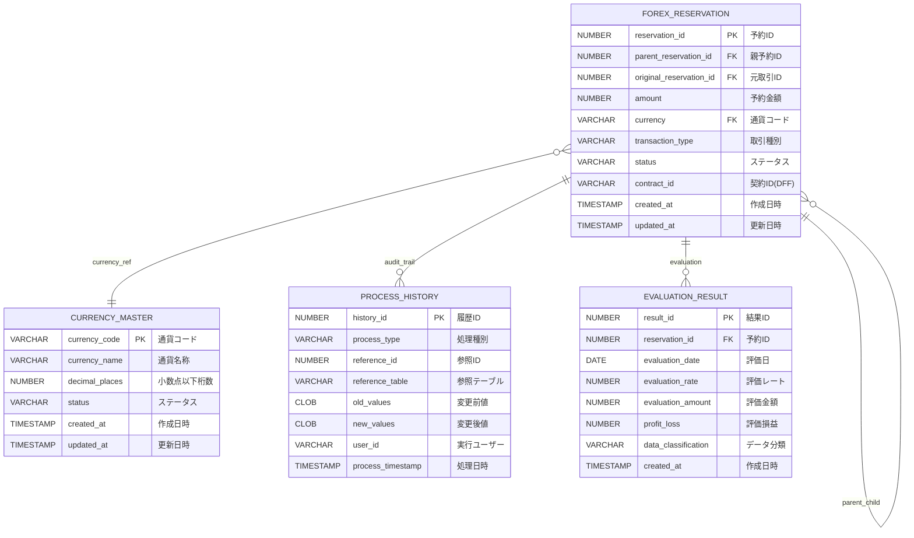

# A01: データベース設計書（PaaS各領域毎）

## 1. 概要・前提条件

### 1.1 目的
本ドキュメントは、Oracle Cloud Infrastructure（OCI）環境でのPaaSアプリケーション開発における、データベース設計の標準的なアプローチとドキュメント化方法を示すサンプルです。

### 1.2 技術環境
- **データベース**: Oracle Autonomous Database（ADB）
- **開発言語**: PL/SQL、APEX
- **設計方針**: 疎結合設計、DFF活用、親子関係管理

### 1.3 設計原則
- **正規化**: 第3正規形を基本とし、性能要件に応じて非正規化を検討
- **拡張性**: 将来的な項目追加・変更に対応できる柔軟な設計
- **監査性**: 全ての業務取引について完全な監査証跡を保持
- **親子関係**: 分割・統合処理に対応した階層管理

### 1.4 命名規則
- **テーブル名**: 小文字+アンダースコア（例：forex_reservation）
- **カラム名**: 小文字+アンダースコア（例：reservation_id）
- **インデックス名**: idx_[テーブル名略称]_[項目名]（例：idx_forex_parent）
- **制約名**: [制約種別]_[テーブル名略称]_[項目名]（例：fk_forex_currency）

## 2. 全体ER図



## 3. テーブル設計

### 3.1 通貨マスタ（currency_master）

#### テーブル概要
**業務目的**: 取引で使用する通貨の基本情報を管理  
**更新頻度**: 低（新通貨追加・ステータス変更時のみ）  
**参照頻度**: 高（全ての為替取引で参照）

#### 項目定義

| 項目名 | 物理名 | 型 | サイズ | NULL | キー | デフォルト | 説明 | 業務ルール |
|--------|--------|----|----|----|----|----------|------|------------|
| 通貨コード | currency_code | VARCHAR2 | 3 | ✗ | PK | - | ISO通貨コード | ISO 4217準拠（USD、EUR、JPY等） |
| 通貨名称 | currency_name | VARCHAR2 | 100 | ✗ | - | - | 通貨の正式名称 | 英語表記、必須入力 |
| 小数点桁数 | decimal_places | NUMBER | 1 | ✗ | - | 2 | 金額の小数点以下桁数 | 0-4の範囲、通貨ごとに固定 |
| ステータス | status | VARCHAR2 | 20 | ✗ | - | 'ACTIVE' | 通貨の利用状況 | ACTIVE/INACTIVE/DEPRECATED |
| 表示順序 | display_order | NUMBER | 3 | ✓ | - | NULL | 画面表示時の並び順 | 昇順で表示、NULLは最後 |
| 作成日時 | created_at | TIMESTAMP | - | ✗ | - | SYSDATE | レコード作成日時 | システム自動設定 |
| 更新日時 | updated_at | TIMESTAMP | - | ✗ | - | SYSDATE | レコード更新日時 | 更新時自動設定 |
| 作成者 | created_by | VARCHAR2 | 50 | ✗ | - | USER | 作成ユーザー | セッションユーザー |
| 更新者 | updated_by | VARCHAR2 | 50 | ✗ | - | USER | 更新ユーザー | 更新時セッションユーザー |

#### インデックス定義

| インデックス名 | 対象項目 | 種別 | 一意性 | 目的 |
|---------------|----------|------|--------|------|
| pk_currency_master | currency_code | Primary | ✓ | 主キー |
| idx_currency_status | status | B-tree | ✗ | ステータス検索 |
| idx_currency_order | display_order | B-tree | ✗ | 表示順序ソート |

#### 制約定義

| 制約名 | 種別 | 条件/参照先 | 説明 |
|--------|------|-------------|------|
| pk_currency_master | PRIMARY KEY | currency_code | 主キー制約 |
| chk_currency_code_format | CHECK | REGEXP_LIKE(currency_code, '^[A-Z]{3}$') | 通貨コードは3文字大文字英字 |
| chk_currency_decimal_range | CHECK | decimal_places BETWEEN 0 AND 4 | 小数点桁数は0-4の範囲 |
| chk_currency_status | CHECK | status IN ('ACTIVE', 'INACTIVE', 'DEPRECATED') | ステータス値チェック |

### 3.2 為替予約テーブル（forex_reservation）

#### テーブル概要
**業務目的**: 社内為替予約の分割・統合管理、親子関係の追跡  
**更新頻度**: 高（日次の分割・統合処理）  
**参照頻度**: 高（リアルタイム残高照会、評価替え処理）

#### 項目定義

| 項目名 | 物理名 | 型 | サイズ | NULL | キー | デフォルト | 説明 | 業務ルール |
|--------|--------|----|----|----|----|----------|------|------------|
| 予約ID | reservation_id | NUMBER | 18 | ✗ | PK | シーケンス | 為替予約の一意識別子 | システム自動採番（AYFIX形式） |
| 親予約ID | parent_reservation_id | NUMBER | 18 | ✓ | FK | NULL | 分割元の予約ID | 分割時のみ設定、元取引はNULL |
| 元取引ID | original_reservation_id | NUMBER | 18 | ✗ | FK | - | 最初の取引ID | 分割されても最初のIDを保持 |
| 予約金額 | amount | NUMBER | 15,2 | ✗ | - | - | 予約金額 | 正の値のみ、通貨の小数点桁数に準拠 |
| 通貨コード | currency | VARCHAR2 | 3 | ✗ | FK | - | 取引通貨 | currency_masterと連携 |
| 取引種別 | transaction_type | VARCHAR2 | 20 | ✗ | - | - | 取引の種別 | ORIGINAL/WITHDRAWAL/REMAINING |
| ステータス | status | VARCHAR2 | 20 | ✗ | - | 'ACTIVE' | 予約の状態 | ACTIVE/PROCESSED/CANCELLED |
| 契約ID | contract_id | VARCHAR2 | 50 | ✓ | - | NULL | 関連する契約ID | DFF項目、外部システム連携用 |
| 部門コード | department_code | VARCHAR2 | 10 | ✗ | - | - | 予約を行った部門 | 組織マスタと連携 |
| 決済予定日 | settlement_date | DATE | - | ✗ | - | - | 決済予定日 | 営業日チェック必須 |
| 予約レート | reservation_rate | NUMBER | 10,6 | ✓ | - | NULL | 予約時適用レート | 先行予約以外は必須 |
| 作成日時 | created_at | TIMESTAMP | - | ✗ | - | SYSDATE | レコード作成日時 | システム自動設定 |
| 更新日時 | updated_at | TIMESTAMP | - | ✗ | - | SYSDATE | レコード更新日時 | 更新時自動設定 |
| 作成者 | created_by | VARCHAR2 | 50 | ✗ | - | USER | 作成ユーザー | セッションユーザー |
| 更新者 | updated_by | VARCHAR2 | 50 | ✗ | - | USER | 更新ユーザー | 更新時セッションユーザー |

#### インデックス定義

| インデックス名 | 対象項目 | 種別 | 一意性 | 目的 |
|---------------|----------|------|--------|------|
| pk_forex_reservation | reservation_id | Primary | ✓ | 主キー |
| idx_forex_parent | parent_reservation_id | B-tree | ✗ | 親子関係検索 |
| idx_forex_original | original_reservation_id | B-tree | ✗ | 元取引追跡 |
| idx_forex_contract | contract_id | B-tree | ✗ | 契約ID検索 |
| idx_forex_dept_date | department_code, settlement_date | 複合 | ✗ | 部門別決済日検索 |
| idx_forex_currency_status | currency, status | 複合 | ✗ | 通貨別ステータス検索 |

#### 制約定義

| 制約名 | 種別 | 条件/参照先 | 説明 |
|--------|------|-------------|------|
| pk_forex_reservation | PRIMARY KEY | reservation_id | 主キー制約 |
| fk_forex_parent | FOREIGN KEY | parent_reservation_id → reservation_id | 親子関係整合性 |
| fk_forex_original | FOREIGN KEY | original_reservation_id → reservation_id | 元取引参照整合性 |
| fk_forex_currency | FOREIGN KEY | currency → currency_master.currency_code | 通貨参照整合性 |
| chk_forex_amount_positive | CHECK | amount > 0 | 金額は正の値 |
| chk_forex_self_reference | CHECK | reservation_id != parent_reservation_id | 自己参照禁止 |
| chk_forex_transaction_type | CHECK | transaction_type IN ('ORIGINAL', 'WITHDRAWAL', 'REMAINING') | 取引種別チェック |
| chk_forex_status | CHECK | status IN ('ACTIVE', 'PROCESSED', 'CANCELLED') | ステータス値チェック |

### 3.3 処理履歴テーブル（process_history）

#### テーブル概要
**業務目的**: 全ての業務処理の監査証跡を記録  
**更新頻度**: 高（全トランザクション処理時に挿入）  
**参照頻度**: 低（監査時、障害調査時のみ）

#### 項目定義

| 項目名 | 物理名 | 型 | サイズ | NULL | キー | デフォルト | 説明 | 業務ルール |
|--------|--------|----|----|----|----|----------|------|------------|
| 履歴ID | history_id | NUMBER | 18 | ✗ | PK | シーケンス | 履歴の一意識別子 | システム自動採番 |
| 処理種別 | process_type | VARCHAR2 | 50 | ✗ | - | - | 処理の種類 | INSERT/UPDATE/DELETE/CALCULATE等 |
| 参照ID | reference_id | NUMBER | 18 | ✗ | - | - | 処理対象のID | 対象レコードの主キー値 |
| 参照テーブル | reference_table | VARCHAR2 | 50 | ✗ | - | - | 処理対象テーブル | 物理テーブル名 |
| 変更前値 | old_values | CLOB | - | ✓ | - | NULL | 変更前のデータ | JSON形式、INSERT時はNULL |
| 変更後値 | new_values | CLOB | - | ✓ | - | NULL | 変更後のデータ | JSON形式、DELETE時はNULL |
| 実行ユーザー | user_id | VARCHAR2 | 50 | ✗ | - | USER | 処理実行ユーザー | セッションユーザーまたはバッチID |
| 処理プログラム | program_name | VARCHAR2 | 100 | ✓ | - | NULL | 実行プログラム名 | バッチ名、画面ID等 |
| IPアドレス | ip_address | VARCHAR2 | 45 | ✓ | - | NULL | アクセス元IP | IPv4/IPv6対応 |
| セッションID | session_id | VARCHAR2 | 100 | ✓ | - | NULL | セッション識別子 | 同一セッション内処理の追跡用 |
| 処理日時 | process_timestamp | TIMESTAMP | - | ✗ | - | SYSTIMESTAMP | 処理実行日時 | マイクロ秒まで記録 |
| 処理結果 | result_status | VARCHAR2 | 20 | ✗ | - | 'SUCCESS' | 処理結果 | SUCCESS/ERROR/WARNING |
| エラーメッセージ | error_message | VARCHAR2 | 4000 | ✓ | - | NULL | エラー内容 | エラー時のメッセージ |

#### インデックス定義

| インデックス名 | 対象項目 | 種別 | 一意性 | 目的 |
|---------------|----------|------|--------|------|
| pk_process_history | history_id | Primary | ✓ | 主キー |
| idx_history_reference | reference_table, reference_id | 複合 | ✗ | 対象レコード追跡 |
| idx_history_user_time | user_id, process_timestamp | 複合 | ✗ | ユーザー別処理履歴 |
| idx_history_session | session_id | B-tree | ✗ | セッション別処理追跡 |
| idx_history_timestamp | process_timestamp | B-tree | ✗ | 日時範囲検索 |

### 3.4 評価替え結果テーブル（evaluation_result）

#### テーブル概要
**業務目的**: 為替評価替え処理の結果を管理  
**更新頻度**: 中（日次評価替え処理時）  
**参照頻度**: 中（月次決算、分析レポート作成時）

#### 項目定義

| 項目名 | 物理名 | 型 | サイズ | NULL | キー | デフォルト | 説明 | 業務ルール |
|--------|--------|----|----|----|----|----------|------|------------|
| 結果ID | result_id | NUMBER | 18 | ✗ | PK | シーケンス | 評価結果の一意識別子 | システム自動採番 |
| 予約ID | reservation_id | NUMBER | 18 | ✗ | FK | - | 対象予約ID | forex_reservationと連携 |
| 評価日 | evaluation_date | DATE | - | ✗ | - | - | 評価替え実行日 | 営業日のみ |
| 評価レート | evaluation_rate | NUMBER | 10,6 | ✗ | - | - | 評価時適用レート | 市場レート、小数点6桁 |
| 評価金額 | evaluation_amount | NUMBER | 15,2 | ✗ | - | - | 評価後金額 | 予約金額×評価レート |
| 評価損益 | profit_loss | NUMBER | 15,2 | ✗ | - | - | 評価損益金額 | (評価レート-予約レート)×金額 |
| データ分類 | data_classification | VARCHAR2 | 10 | ✗ | - | - | 評価区分 | A1/A2/A3/AD/ACK/AZ |
| 評価対象フラグ | evaluation_target | VARCHAR2 | 10 | ✗ | - | - | 評価対象区分 | 対象/対象外 |
| 暦月 | calendar_month | VARCHAR2 | 7 | ✗ | - | - | 決済予定月 | YYYY/MM形式 |
| バッチ実行ID | batch_execution_id | VARCHAR2 | 50 | ✗ | - | - | バッチ実行識別子 | 同一バッチでの一括処理識別 |
| 作成日時 | created_at | TIMESTAMP | - | ✗ | - | SYSDATE | レコード作成日時 | システム自動設定 |

#### インデックス定義

| インデックス名 | 対象項目 | 種別 | 一意性 | 目的 |
|---------------|----------|------|--------|------|
| pk_evaluation_result | result_id | Primary | ✓ | 主キー |
| idx_eval_reservation | reservation_id | B-tree | ✗ | 予約別結果検索 |
| idx_eval_date | evaluation_date | B-tree | ✗ | 日付別検索 |
| idx_eval_classification | data_classification | B-tree | ✗ | 分類別集計 |
| idx_eval_month_batch | calendar_month, batch_execution_id | 複合 | ✗ | 月次バッチ結果検索 |

## 4. インデックス・制約設計

### 4.1 インデックス設計方針

#### パフォーマンス要件
- **検索性能**: 主要検索条件に対して適切なインデックスを配置
- **更新性能**: 不要なインデックスを避け、更新処理への影響を最小化
- **メンテナンス性**: インデックスの断片化を考慮した設計

#### 複合インデックスの考慮点
- **選択性の高い列を先頭に配置**
- **WHERE句の条件順序に合わせた列順**
- **ORDER BY句を考慮した列順**

### 4.2 制約設計方針

#### データ整合性保証
- **参照整合性**: 外部キー制約による関連データの整合性保証
- **ドメイン整合性**: CHECK制約による値域の妥当性チェック
- **一意性**: 業務上の一意性要件をUNIQUE制約で保証

#### パフォーマンス考慮
- **制約の評価順序**: 効率的なチェック順序を考慮
- **無効化可能性**: 大量データ更新時の制約無効化を考慮

## 5. 生成AI活用ガイド

### 5.1 DDL生成時の活用方法

#### 基本的なプロンプト構造
```
以下のMarkdownテーブル定義からOracle DDLを生成してください：

[テーブル定義をコピー&ペースト]

要件：
- Oracle Database 19c以降対応
- 適切なデフォルト値設定
- 制約条件の実装
- 日本語コメントの付与
- インデックスの自動作成
```

#### 高度なプロンプト例
```
以下の要件でテーブル設計を最適化してください：

テーブル定義：
[Markdownテーブル定義]

最適化要件：
1. 月間1000万レコードの挿入性能
2. 複雑な検索クエリ（3テーブル結合）の応答時間2秒以内
3. 90日間のデータ保持（パーティション分割）
4. 監査要件（全変更履歴の保持）

出力：
- 最適化されたDDL文
- パーティション設計
- インデックス設計の根拠
- 性能見積もり
```

### 5.2 PL/SQL生成時の活用方法

#### データアクセス用プロシージャ生成
```
以下のテーブル定義から標準的なCRUD操作のPL/SQLパッケージを生成してください：

[テーブル定義]

要件：
- 例外処理の実装
- 履歴ログの自動記録
- 楽観ロック制御
- 入力値検証
```

### 5.3 テストデータ生成の活用

#### テストデータ生成プロンプト
```
以下のテーブル定義に基づいて、リアルなテストデータ生成SQLを作成してください：

[テーブル定義]

データ要件：
- 各テーブル1000件のデータ
- 現実的な業務データパターン
- 親子関係の整合性保証
- 日本語データの含有
```

## 6. DDL生成用プロンプトテンプレート

### 6.1 基本テンプレート

```markdown
## DDL生成プロンプト

以下のテーブル設計からOracle DDLを生成してください：

### テーブル: {table_name}
{markdown_table_definition}

### 要件:
- Oracle Database 19c以降
- 表領域: USERS
- 初期サイズ: 100M
- 自動拡張: ON
- シーケンス自動生成（主キーがNUMBER型の場合）
- トリガー自動生成（created_at, updated_at, created_by, updated_by）
- 制約名とインデックス名は命名規則に従う
- 全項目に日本語コメントを付与

### 出力形式:
1. CREATE TABLE文
2. CREATE INDEX文（必要な場合）
3. CREATE SEQUENCE文（必要な場合）
4. CREATE TRIGGER文（監査項目用）
5. ALTER TABLE文（制約追加用）
```

### 6.2 パフォーマンス最適化テンプレート

```markdown
## パフォーマンス最適化DDL生成プロンプト

### 業務要件:
- 想定データ量: {record_count}
- 主要検索パターン: {search_patterns}
- 更新頻度: {update_frequency}
- 保持期間: {retention_period}

### テーブル設計:
{markdown_table_definition}

### 最適化要求:
1. 検索性能: {performance_requirement}
2. 更新性能: {update_performance_requirement}
3. ストレージ効率: {storage_requirement}
4. パーティション要否: {partitioning_requirement}

### 出力:
- 最適化されたDDL
- インデックス設計の根拠
- パーティション設計（必要な場合）
- 性能予測値
```

### 6.3 移行・メンテナンス用テンプレート

```markdown
## データ移行・メンテナンス用DDL生成プロンプト

### 移行元テーブル構造:
{source_table_structure}

### 移行先テーブル設計:
{target_table_definition}

### 移行要件:
- データ量: {data_volume}
- 移行方式: {migration_method}
- ダウンタイム制限: {downtime_limit}
- データ変換ルール: {transformation_rules}

### 出力:
1. 移行先テーブルDDL
2. データ移行SQL
3. 移行前後検証SQL
4. ロールバック用SQL
5. 移行手順書
```

---

## 付録: 参考資料

### A. Oracle Database設計標準
- [Oracle Database設計ガイド](https://docs.oracle.com/en/database/)
- [PL/SQL開発者ガイド](https://docs.oracle.com/en/database/oracle/oracle-database/)

### B. 命名規則詳細
- テーブル名: 最大30文字、小文字+アンダースコア
- カラム名: 最大30文字、小文字+アンダースコア、省略語使用可
- インデックス名: idx_[テーブル略称]_[カラム略称]
- 制約名: [制約種別]_[テーブル略称]_[カラム略称]

### C. 生成AI活用のベストプラクティス
- プロンプトの構造化
- 要件の明確化
- 出力形式の指定
- 反復改善のプロセス
