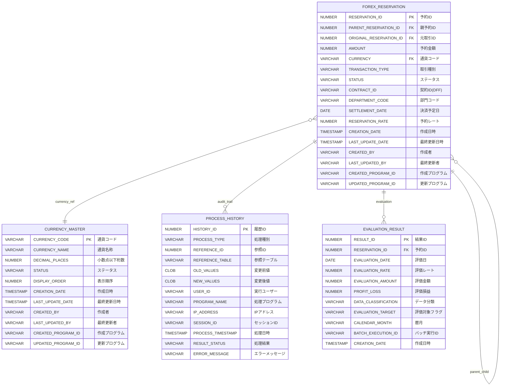

# A01: データベース設計書（PaaS各領域毎）

## 1. 概要・前提条件

### 1.1 目的
本ドキュメントは、Oracle Cloud Infrastructure（OCI）環境でのPaaSアプリケーション開発における、データベース設計の標準的なアプローチとドキュメント化方法を示すサンプルです。

### 1.2 技術環境
- **データベース**: Oracle Autonomous Database（ADB）
- **開発言語**: PL/SQL、APEX
- **設計方針**: 疎結合設計、DFF活用、親子関係管理

### 1.3 設計原則
- **正規化**: 第3正規形を基本とし、性能要件に応じて非正規化を検討
- **拡張性**: 将来的な項目追加・変更に対応できる柔軟な設計
- **監査性**: 全ての業務取引について完全な監査証跡を保持
- **親子関係**: 分割・統合処理に対応した階層管理

## 2. テーブル一覧

| No. | テーブル名 | 論理名 | 分類 | 主要用途 | 更新頻度 | 備考 |
|-----|------------|--------|------|----------|----------|------|
| 1 | CURRENCY_MASTER | 通貨マスタ | マスタ | 取引通貨の基本情報管理 | 低 | ISO 4217準拠 |
| 2 | FOREX_RESERVATION | 為替予約テーブル | トランザクション | 社内為替予約の分割・統合管理 | 高 | 親子関係管理 |
| 3 | PROCESS_HISTORY | 処理履歴テーブル | 履歴 | 全業務処理の監査証跡記録 | 高 | JSON形式で変更内容保持 |
| 4 | EVALUATION_RESULT | 評価替え結果テーブル | 集計 | 為替評価替え処理結果管理 | 中 | 日次バッチ処理結果 |

## 3. 全体ER図



## 4. テーブル設計

### 4.1 通貨マスタ（CURRENCY_MASTER）

#### テーブル概要
**業務目的**: 取引で使用する通貨の基本情報を管理  
**更新頻度**: 低（新通貨追加・ステータス変更時のみ）  
**参照頻度**: 高（全ての為替取引で参照）

#### 項目定義

| 項目名 | 物理名 | 型 | サイズ | NULL | キー | デフォルト | 説明 | 業務ルール |
|--------|--------|----|----|----|----|----------|------|------------|
| 通貨コード | CURRENCY_CODE | VARCHAR2 | 3 | ✗ | PK | - | ISO通貨コード | ISO 4217準拠（USD、EUR、JPY等） |
| 通貨名称 | CURRENCY_NAME | VARCHAR2 | 100 | ✗ | - | - | 通貨の正式名称 | 英語表記、必須入力 |
| 小数点桁数 | DECIMAL_PLACES | NUMBER | 1 | ✗ | - | 2 | 金額の小数点以下桁数 | 0-4の範囲、通貨ごとに固定 |
| ステータス | STATUS | VARCHAR2 | 20 | ✗ | - | 'ACTIVE' | 通貨の利用状況 | ACTIVE/INACTIVE/DEPRECATED |
| 表示順序 | DISPLAY_ORDER | NUMBER | 3 | ✓ | - | NULL | 画面表示時の並び順 | 昇順で表示、NULLは最後 |
| 作成日時 | CREATION_DATE | TIMESTAMP | - | ✗ | - | SYSDATE | レコード作成日時 | システム自動設定 |
| 最終更新日時 | LAST_UPDATE_DATE | TIMESTAMP | - | ✗ | - | SYSDATE | レコード更新日時 | 更新時自動設定 |
| 作成者 | CREATED_BY | VARCHAR2 | 64 | ✗ | - | USER | 作成ユーザー | セッションユーザー |
| 最終更新者 | LAST_UPDATED_BY | VARCHAR2 | 64 | ✗ | - | USER | 更新ユーザー | 更新時セッションユーザー |
| 作成プログラム | CREATED_PROGRAM_ID | VARCHAR2 | 64 | ✗ | - | - | 作成プログラムID | 機能識別コード |
| 更新プログラム | UPDATED_PROGRAM_ID | VARCHAR2 | 64 | ✗ | - | - | 更新プログラムID | 機能識別コード |

#### インデックス定義

| インデックス名 | 対象項目 | 種別 | 一意性 | 目的 |
|---------------|----------|------|--------|------|
| FE_CURRENCY_MASTER_PK | CURRENCY_CODE | Primary | ✓ | 主キー |
| FE_CURRENCY_MASTER_N1 | STATUS | B-tree | ✗ | ステータス検索 |
| FE_CURRENCY_MASTER_N2 | DISPLAY_ORDER | B-tree | ✗ | 表示順序ソート |

#### 制約定義

| 制約名 | 種別 | 条件/参照先 | 説明 |
|--------|------|-------------|------|
| FE_CURRENCY_MASTER_PK | PRIMARY KEY | CURRENCY_CODE | 主キー制約 |
| CHK_CM_CURRENCY_CODE | CHECK | REGEXP_LIKE(CURRENCY_CODE, '^[A-Z]{3}$') | 通貨コードは3文字大文字英字 |
| CHK_CM_DECIMAL_RANGE | CHECK | DECIMAL_PLACES BETWEEN 0 AND 4 | 小数点桁数は0-4の範囲 |
| CHK_CM_STATUS | CHECK | STATUS IN ('ACTIVE', 'INACTIVE', 'DEPRECATED') | ステータス値チェック |

### 4.2 為替予約テーブル（FOREX_RESERVATION）

#### テーブル概要
**業務目的**: 社内為替予約の分割・統合管理、親子関係の追跡  
**更新頻度**: 高（日次の分割・統合処理）  
**参照頻度**: 高（リアルタイム残高照会、評価替え処理）

#### 項目定義

| 項目名 | 物理名 | 型 | サイズ | NULL | キー | デフォルト | 説明 | 業務ルール |
|--------|--------|----|----|----|----|----------|------|------------|
| 予約ID | RESERVATION_ID | NUMBER | 18 | ✗ | PK | シーケンス | 為替予約の一意識別子 | システム自動採番（AYFIX形式） |
| 親予約ID | PARENT_RESERVATION_ID | NUMBER | 18 | ✓ | FK | NULL | 分割元の予約ID | 分割時のみ設定、元取引はNULL |
| 元取引ID | ORIGINAL_RESERVATION_ID | NUMBER | 18 | ✗ | FK | - | 最初の取引ID | 分割されても最初のIDを保持 |
| 予約金額 | AMOUNT | NUMBER | 15,2 | ✗ | - | - | 予約金額 | 正の値のみ、通貨の小数点桁数に準拠 |
| 通貨コード | CURRENCY | VARCHAR2 | 3 | ✗ | FK | - | 取引通貨 | CURRENCY_MASTERと連携 |
| 取引種別 | TRANSACTION_TYPE | VARCHAR2 | 20 | ✗ | - | - | 取引の種別 | ORIGINAL/WITHDRAWAL/REMAINING |
| ステータス | STATUS | VARCHAR2 | 20 | ✗ | - | 'ACTIVE' | 予約の状態 | ACTIVE/PROCESSED/CANCELLED |
| 契約ID | CONTRACT_ID | VARCHAR2 | 50 | ✓ | - | NULL | 関連する契約ID | DFF項目、外部システム連携用 |
| 部門コード | DEPARTMENT_CODE | VARCHAR2 | 10 | ✗ | - | - | 予約を行った部門 | 組織マスタと連携 |
| 決済予定日 | SETTLEMENT_DATE | DATE | - | ✗ | - | - | 決済予定日 | 営業日チェック必須 |
| 予約レート | RESERVATION_RATE | NUMBER | 10,6 | ✓ | - | NULL | 予約時適用レート | 先行予約以外は必須 |
| 作成日時 | CREATION_DATE | TIMESTAMP | - | ✗ | - | SYSDATE | レコード作成日時 | システム自動設定 |
| 最終更新日時 | LAST_UPDATE_DATE | TIMESTAMP | - | ✗ | - | SYSDATE | レコード更新日時 | 更新時自動設定 |
| 作成者 | CREATED_BY | VARCHAR2 | 64 | ✗ | - | USER | 作成ユーザー | セッションユーザー |
| 最終更新者 | LAST_UPDATED_BY | VARCHAR2 | 64 | ✗ | - | USER | 更新ユーザー | 更新時セッションユーザー |
| 作成プログラム | CREATED_PROGRAM_ID | VARCHAR2 | 64 | ✗ | - | - | 作成プログラムID | 機能識別コード |
| 更新プログラム | UPDATED_PROGRAM_ID | VARCHAR2 | 64 | ✗ | - | - | 更新プログラムID | 機能識別コード |

#### インデックス定義

| インデックス名 | 対象項目 | 種別 | 一意性 | 目的 |
|---------------|----------|------|--------|------|
| FE_FOREX_RESERVATION_PK | RESERVATION_ID | Primary | ✓ | 主キー |
| FE_FOREX_RESERVATION_N1 | PARENT_RESERVATION_ID | B-tree | ✗ | 親子関係検索 |
| FE_FOREX_RESERVATION_N2 | ORIGINAL_RESERVATION_ID | B-tree | ✗ | 元取引追跡 |
| FE_FOREX_RESERVATION_N3 | CONTRACT_ID | B-tree | ✗ | 契約ID検索 |
| FE_FOREX_RESERVATION_N4 | DEPARTMENT_CODE, SETTLEMENT_DATE | 複合 | ✗ | 部門別決済日検索 |
| FE_FOREX_RESERVATION_N5 | CURRENCY, STATUS | 複合 | ✗ | 通貨別ステータス検索 |

#### 制約定義

| 制約名 | 種別 | 条件/参照先 | 説明 |
|--------|------|-------------|------|
| FE_FOREX_RESERVATION_PK | PRIMARY KEY | RESERVATION_ID | 主キー制約 |
| FK_FR_PARENT | FOREIGN KEY | PARENT_RESERVATION_ID → RESERVATION_ID | 親子関係整合性 |
| FK_FR_ORIGINAL | FOREIGN KEY | ORIGINAL_RESERVATION_ID → RESERVATION_ID | 元取引参照整合性 |
| FK_FR_CURRENCY | FOREIGN KEY | CURRENCY → CURRENCY_MASTER.CURRENCY_CODE | 通貨参照整合性 |
| CHK_FR_AMOUNT_POSITIVE | CHECK | AMOUNT > 0 | 金額は正の値 |
| CHK_FR_SELF_REFERENCE | CHECK | RESERVATION_ID != PARENT_RESERVATION_ID | 自己参照禁止 |
| CHK_FR_TRANSACTION_TYPE | CHECK | TRANSACTION_TYPE IN ('ORIGINAL', 'WITHDRAWAL', 'REMAINING') | 取引種別チェック |
| CHK_FR_STATUS | CHECK | STATUS IN ('ACTIVE', 'PROCESSED', 'CANCELLED') | ステータス値チェック |

### 4.3 処理履歴テーブル（PROCESS_HISTORY）

#### テーブル概要
**業務目的**: 全ての業務処理の監査証跡を記録  
**更新頻度**: 高（全トランザクション処理時に挿入）  
**参照頻度**: 低（監査時、障害調査時のみ）

#### 項目定義

| 項目名 | 物理名 | 型 | サイズ | NULL | キー | デフォルト | 説明 | 業務ルール |
|--------|--------|----|----|----|----|----------|------|------------|
| 履歴ID | HISTORY_ID | NUMBER | 18 | ✗ | PK | シーケンス | 履歴の一意識別子 | システム自動採番 |
| 処理種別 | PROCESS_TYPE | VARCHAR2 | 50 | ✗ | - | - | 処理の種類 | INSERT/UPDATE/DELETE/CALCULATE等 |
| 参照ID | REFERENCE_ID | NUMBER | 18 | ✗ | - | - | 処理対象のID | 対象レコードの主キー値 |
| 参照テーブル | REFERENCE_TABLE | VARCHAR2 | 50 | ✗ | - | - | 処理対象テーブル | 物理テーブル名 |
| 変更前値 | OLD_VALUES | CLOB | - | ✓ | - | NULL | 変更前のデータ | JSON形式、INSERT時はNULL |
| 変更後値 | NEW_VALUES | CLOB | - | ✓ | - | NULL | 変更後のデータ | JSON形式、DELETE時はNULL |
| 実行ユーザー | USER_ID | VARCHAR2 | 64 | ✗ | - | USER | 処理実行ユーザー | セッションユーザーまたはバッチID |
| 処理プログラム | PROGRAM_NAME | VARCHAR2 | 100 | ✓ | - | NULL | 実行プログラム名 | バッチ名、画面ID等 |
| IPアドレス | IP_ADDRESS | VARCHAR2 | 45 | ✓ | - | NULL | アクセス元IP | IPv4/IPv6対応 |
| セッションID | SESSION_ID | VARCHAR2 | 100 | ✓ | - | NULL | セッション識別子 | 同一セッション内処理の追跡用 |
| 処理日時 | PROCESS_TIMESTAMP | TIMESTAMP | - | ✗ | - | SYSTIMESTAMP | 処理実行日時 | マイクロ秒まで記録 |
| 処理結果 | RESULT_STATUS | VARCHAR2 | 20 | ✗ | - | 'SUCCESS' | 処理結果 | SUCCESS/ERROR/WARNING |
| エラーメッセージ | ERROR_MESSAGE | VARCHAR2 | 4000 | ✓ | - | NULL | エラー内容 | エラー時のメッセージ |

#### インデックス定義

| インデックス名 | 対象項目 | 種別 | 一意性 | 目的 |
|---------------|----------|------|--------|------|
| FE_PROCESS_HISTORY_PK | HISTORY_ID | Primary | ✓ | 主キー |
| FE_PROCESS_HISTORY_N1 | REFERENCE_TABLE, REFERENCE_ID | 複合 | ✗ | 対象レコード追跡 |
| FE_PROCESS_HISTORY_N2 | USER_ID, PROCESS_TIMESTAMP | 複合 | ✗ | ユーザー別処理履歴 |
| FE_PROCESS_HISTORY_N3 | SESSION_ID | B-tree | ✗ | セッション別処理追跡 |
| FE_PROCESS_HISTORY_N4 | PROCESS_TIMESTAMP | B-tree | ✗ | 日時範囲検索 |

### 4.4 評価替え結果テーブル（EVALUATION_RESULT）

#### テーブル概要
**業務目的**: 為替評価替え処理の結果を管理  
**更新頻度**: 中（日次評価替え処理時）  
**参照頻度**: 中（月次決算、分析レポート作成時）

#### 項目定義

| 項目名 | 物理名 | 型 | サイズ | NULL | キー | デフォルト | 説明 | 業務ルール |
|--------|--------|----|----|----|----|----------|------|------------|
| 結果ID | RESULT_ID | NUMBER | 18 | ✗ | PK | シーケンス | 評価結果の一意識別子 | システム自動採番 |
| 予約ID | RESERVATION_ID | NUMBER | 18 | ✗ | FK | - | 対象予約ID | FOREX_RESERVATIONと連携 |
| 評価日 | EVALUATION_DATE | DATE | - | ✗ | - | - | 評価替え実行日 | 営業日のみ |
| 評価レート | EVALUATION_RATE | NUMBER | 10,6 | ✗ | - | - | 評価時適用レート | 市場レート、小数点6桁 |
| 評価金額 | EVALUATION_AMOUNT | NUMBER | 15,2 | ✗ | - | - | 評価後金額 | 予約金額×評価レート |
| 評価損益 | PROFIT_LOSS | NUMBER | 15,2 | ✗ | - | - | 評価損益金額 | (評価レート-予約レート)×金額 |
| データ分類 | DATA_CLASSIFICATION | VARCHAR2 | 10 | ✗ | - | - | 評価区分 | A1/A2/A3/AD/ACK/AZ |
| 評価対象フラグ | EVALUATION_TARGET | VARCHAR2 | 10 | ✗ | - | - | 評価対象区分 | 対象/対象外 |
| 暦月 | CALENDAR_MONTH | VARCHAR2 | 7 | ✗ | - | - | 決済予定月 | YYYY/MM形式 |
| バッチ実行ID | BATCH_EXECUTION_ID | VARCHAR2 | 50 | ✗ | - | - | バッチ実行識別子 | 同一バッチでの一括処理識別 |
| 作成日時 | CREATION_DATE | TIMESTAMP | - | ✗ | - | SYSDATE | レコード作成日時 | システム自動設定 |

#### インデックス定義

| インデックス名 | 対象項目 | 種別 | 一意性 | 目的 |
|---------------|----------|------|--------|------|
| FE_EVALUATION_RESULT_PK | RESULT_ID | Primary | ✓ | 主キー |
| FE_EVALUATION_RESULT_N1 | RESERVATION_ID | B-tree | ✗ | 予約別結果検索 |
| FE_EVALUATION_RESULT_N2 | EVALUATION_DATE | B-tree | ✗ | 日付別検索 |
| FE_EVALUATION_RESULT_N3 | DATA_CLASSIFICATION | B-tree | ✗ | 分類別集計 |
| FE_EVALUATION_RESULT_N4 | CALENDAR_MONTH, BATCH_EXECUTION_ID | 複合 | ✗ | 月次バッチ結果検索 |

## 5. インデックス・制約設計

### 5.1 インデックス設計方針

#### パフォーマンス要件
- **検索性能**: 主要検索条件に対して適切なインデックスを配置
- **更新性能**: 不要なインデックスを避け、更新処理への影響を最小化
- **メンテナンス性**: インデックスの断片化を考慮した設計

#### 複合インデックスの考慮点
- **選択性の高い列を先頭に配置**
- **WHERE句の条件順序に合わせた列順**
- **ORDER BY句を考慮した列順**

### 5.2 制約設計方針

#### データ整合性保証
- **参照整合性**: 外部キー制約による関連データの整合性保証
- **ドメイン整合性**: CHECK制約による値域の妥当性チェック
- **一意性**: 業務上の一意性要件をUNIQUE制約で保証

#### パフォーマンス考慮
- **制約の評価順序**: 効率的なチェック順序を考慮
- **無効化可能性**: 大量データ更新時の制約無効化を考慮

## 6. DDL生成用プロンプトテンプレート

### 6.1 基本DDL生成テンプレート

```markdown
## DDL生成プロンプト

以下のテーブル設計からOracle DDLを生成してください：

### テーブル: {table_name}
{markdown_table_definition}

### 要件:
- Oracle Database 19c以降
- 表領域: USERS
- 初期サイズ: 100M
- 自動拡張: ON
- シーケンス自動生成（主キーがNUMBER型の場合）
- トリガー自動生成（CREATION_DATE, LAST_UPDATE_DATE, CREATED_BY, LAST_UPDATED_BY, CREATED_PROGRAM_ID, UPDATED_PROGRAM_ID）
- 制約名とインデックス名は命名規則に従う
- 全項目に日本語コメントを付与

### 出力形式:
1. CREATE TABLE文
2. CREATE INDEX文（必要な場合）
3. CREATE SEQUENCE文（必要な場合）
4. CREATE TRIGGER文（監査項目用）
5. ALTER TABLE文（制約追加用）
```

### 6.2 パフォーマンス最適化DDL生成テンプレート

```markdown
## パフォーマンス最適化DDL生成プロンプト

### 業務要件:
- 想定データ量: {record_count}
- 主要検索パターン: {search_patterns}
- 更新頻度: {update_frequency}
- 保持期間: {retention_period}

### テーブル設計:
{markdown_table_definition}

### 最適化要求:
1. 検索性能: {performance_requirement}
2. 更新性能: {update_performance_requirement}
3. ストレージ効率: {storage_requirement}
4. パーティション要否: {partitioning_requirement}

### 出力:
- 最適化されたDDL
- インデックス設計の根拠
- パーティション設計（必要な場合）
- 性能予測値
```

### 6.3 テストデータ生成プロンプトテンプレート

```markdown
## テストデータ生成プロンプト

以下のテーブル定義に基づいて、リアルなテストデータ生成SQLを作成してください：

### テーブル設計:
{markdown_table_definition}

### データ要件:
- 各テーブル{record_count}件のデータ
- 現実的な業務データパターン
- 親子関係の整合性保証
- 日本語データの含有
- 制約条件を満たすデータ

### 生成パターン:
1. マスタデータ: 実際の業務で使用される値
2. トランザクションデータ: 業務フローに沿った関連データ
3. 履歴データ: 時系列での変更履歴
4. 集計データ: 計算結果の整合性保証

### 出力形式:
- INSERT文（バインド変数使用）
- テストデータ生成用PL/SQLプロシージャ
- データ整合性検証用SQL
```

### 6.4 データ移行DDL生成テンプレート

```markdown
## データ移行DDL生成プロンプト

### 移行元テーブル構造:
{source_table_structure}

### 移行先テーブル設計:
{target_table_definition}

### 移行要件:
- データ量: {data_volume}
- 移行方式: {migration_method}
- ダウンタイム制限: {downtime_limit}
- データ変換ルール: {transformation_rules}

### 出力:
1. 移行先テーブルDDL
2. データ移行SQL（変換ロジック含む）
3. 移行前後データ検証SQL
4. ロールバック用SQL
5. 移行手順書（ステップバイステップ）

### 特記事項:
- 親子関係データの移行順序
- システム項目の自動設定
- 制約の一時無効化手順
- 性能を考慮したバッチサイズ
```

---

## 付録: 命名規則・設計標準

### A. データベースオブジェクト命名規則

#### A.1 基本方針
- 半角英数字、アンダーバーを使用
- 英字は大文字のみ
- 基本、英単語を使用
- システム全体のディクショナリ定義で統一

#### A.2 各オブジェクト命名規則

| 分類 | 命名規則 | 例 | 備考 |
|------|----------|----|----|
| **テーブル** | [領域名]_[説明] | FE_FOREX_RESERVATION | 為替管理領域=FE |
| **テーブルカラム** | [説明] | RESERVATION_ID | システム全体のディクショナリ定義で統一 |
| **インデックス** | [領域名]_[表名]_【分類】[連番] | FE_FOREX_RESERVATION_PK | 【分類】PK:主キー、UK:一意、N:非一意、B:ビットマップ |
| **制約** | [制約種別]_[表名略称]_[項目略称] | FK_FR_CURRENCY | FK:外部キー、CHK:チェック、UK:一意 |
| **シーケンス** | [領域名]_[説明] | FE_RESERVATION_SEQ | - |
| **トリガー** | TRG_[領域名]_[表名略称]_【タイミング】【処理】【タイプ】 | TRG_FE_FR_BUR | 【タイミング】B:前、A:後<br>【処理】I:挿入、U:更新、D:削除<br>【タイプ】S:文、R:行 |

### B. システム項目標準定義

#### B.1 共通システム項目
すべてのトランザクションテーブルに以下の項目を標準装備：

| 日本語名 | カラム名 | 型 | 桁数 | 備考 |
|----------|----------|----|----|------|
| 作成日時 | CREATION_DATE | TIMESTAMP | - | システム自動設定 |
| 作成者 | CREATED_BY | VARCHAR2 | 64 | セッションユーザー |
| 作成プログラム | CREATED_PROGRAM_ID | VARCHAR2 | 64 | 機能識別コード |
| 最終更新日時 | LAST_UPDATE_DATE | TIMESTAMP | - | 更新時自動設定 |
| 最終更新者 | LAST_UPDATED_BY | VARCHAR2 | 64 | 更新時セッションユーザー |
| 更新プログラム | UPDATED_PROGRAM_ID | VARCHAR2 | 64 | 機能識別コード |

#### B.2 その他標準項目
- **会社項目**: 個別定義で必要に応じて設定
- **部門管理**: トランザクションが特定部署に紐づく場合は「DEPARTMENT_CODE」で管理
- **予備項目**: 基本的に予備項目を装備、コード/名称でそれぞれ6項目ずつ

### C. 機能識別コード

#### C.1 PaaS関連機能識別コード
命名規則：**[システム区分][モジュール略称][処理種別][任意略号]**

| 桁 | 分類 | 値 | 説明 |
|----|------|----|----|
| 1桁目 | システム区分 | P | PaaS |
| 2-3桁目 | モジュール略称 | FE | 為替管理 |
| | | C2 | 与信管理 |
| | | PI | 支払指図前債務 |
| | | IC | 利息計算 |
| | | PF | 基盤（Platform） |
| 4-6桁目 | 処理種別 | ENT | 入力画面 |
| | | INQ | 照会画面 |
| | | RPT | 帳票 |
| | | BAT | バッチ処理 |
| | | API | API |
| 7-11桁目 | 任意略号 | - | 5桁のアルファベット・数字による任意略号 |

#### C.2 使用例
- **PFEENTSVPRE**: PaaS為替管理社内為替予約入力画面
- **PFEBATEVALG**: PaaS為替管理評価替えバッチ
- **PFERPTFRSMY**: PaaS為替管理為替予約サマリー帳票

### D. Oracle Database設計標準

#### D.1 データ型選択指針
| 用途 | 推奨データ型 | 備考 |
|------|-------------|------|
| **ID項目** | NUMBER(18) | シーケンス使用、18桁で十分 |
| **金額項目** | NUMBER(15,2) | 小数点以下2桁、通貨マスタ参照 |
| **レート項目** | NUMBER(10,6) | 小数点以下6桁、高精度要求 |
| **コード項目** | VARCHAR2 | 可変長、最大サイズ指定 |
| **フラグ項目** | VARCHAR2(1) | Y/N または 0/1 |
| **日付項目** | DATE | 日付のみ |
| **日時項目** | TIMESTAMP | 日付+時刻、マイクロ秒まで |

#### D.2 制約設計標準
- **NOT NULL制約**: 業務的に必須の項目には必ず設定
- **CHECK制約**: 値域チェック、列挙値チェックに活用
- **UNIQUE制約**: 業務上の一意性要件を保証
- **FOREIGN KEY制約**: 参照整合性の保証、ただし性能への影響を考慮

#### D.3 インデックス設計標準
- **主キーインデックス**: 自動作成、命名規則に従い明示的に命名
- **外部キーインデックス**: 参照性能向上のため作成推奨
- **検索用インデックス**: 主要検索条件に対して作成
- **複合インデックス**: 選択性・使用頻度を考慮して設計

### E. 生成AI活用ベストプラクティス

#### E.1 効果的なプロンプト作成
- **構造化**: 要件を明確に分類・整理
- **具体性**: 曖昧な表現を避け、具体的な指示
- **例示**: 期待する出力形式の例を提示
- **制約明示**: 制約条件や前提条件を明確化

#### E.2 品質向上のポイント
- **段階的実行**: 複雑な要求は段階に分けて実行
- **検証**: 生成結果の妥当性を必ず検証
- **反復改善**: フィードバックを活用した継続改善
- **標準化**: 組織内でのプロンプトテンプレート共有

#### E.3 注意事項
- **セキュリティ**: 機密情報を含む内容の取り扱い注意
- **精度**: 生成されたコードは必ず動作確認
- **保守性**: 可読性・保守性を考慮したコード生成
- **標準準拠**: 組織の設計標準・命名規則への準拠確認
