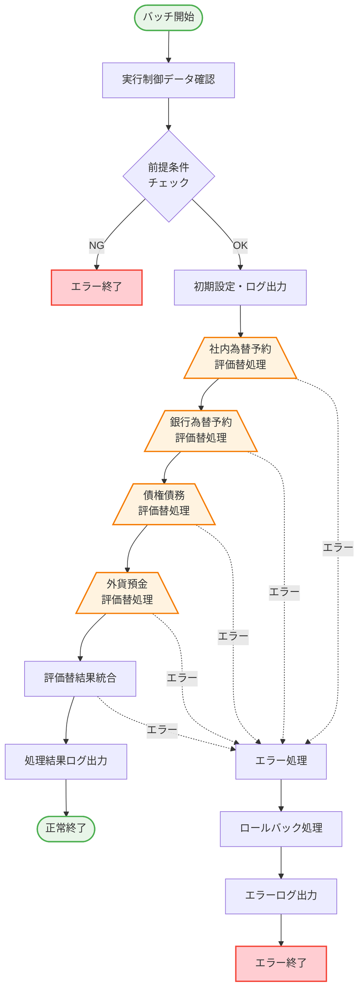
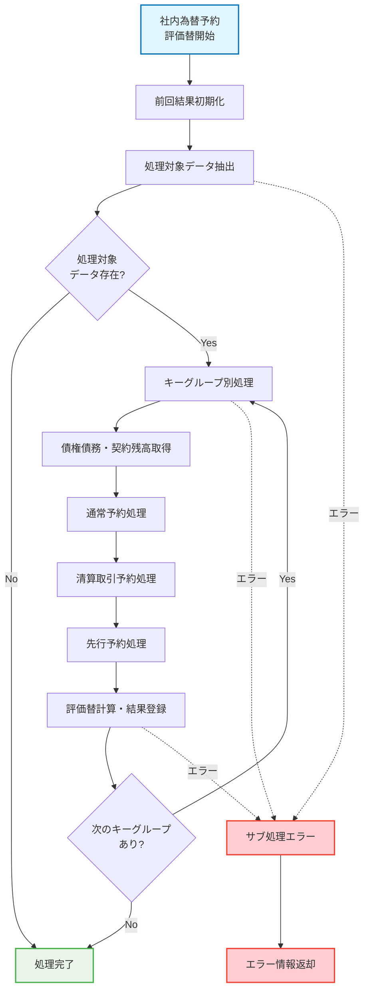
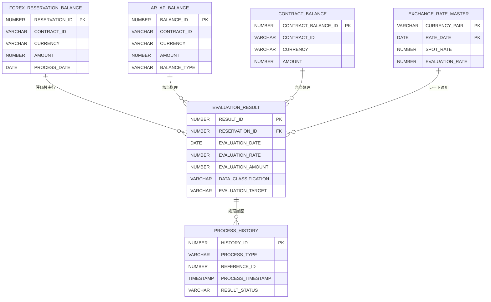

# A03: PL/SQLバッチ処理設計書（PaaS各領域毎）

## 1. 概要・前提条件

### 1.1 目的
本ドキュメントは、Oracle Cloud Infrastructure（OCI）環境でのPaaSアプリケーション開発における、PL/SQLバッチ処理設計の標準的なアプローチとドキュメント化方法を示すサンプルです。

### 1.2 技術環境
- **データベース**: Oracle Autonomous Database（ADB）
- **実行言語**: PL/SQL
- **ジョブ管理**: Tivoli + OIC連携
- **設計方針**: モジュール化、エラーハンドリング標準化、ログ出力統一

### 1.3 設計原則
- **モジュール分割**: 機能単位での独立したプロシージャ設計
- **エラーハンドリング**: 統一されたエラー処理・ログ出力
- **再実行可能性**: 処理中断時の安全な再実行機能
- **性能最適化**: 大量データ処理に対応したバルク処理

### 1.4 命名規則
- **パッケージ名**: PKG_[領域名]_[処理グループ]（例：PKG_FE_EVALUATION）
- **プロシージャ名**: PROC_[領域名]_[処理名]（例：PROC_FE_EVAL_MAIN）
- **ファンクション名**: FUNC_[領域名]_[機能名]（例：FUNC_FE_GET_RATE）

## 2. バッチ処理一覧

| 処理ID | 処理名 | 分類 | 実行頻度 | 想定処理時間 | 前段処理 | 備考 |
|--------|--------|------|----------|------------|----------|------|
| **PFEBATFEEVAL** | 為替評価替処理 | メイン処理 | 日次 | TBD | データ履歴化完了 | 複数サブ処理を統合 |
| PFEBATEFESUB1 | 社内為替予約評価替 | サブ処理 | 日次 | TBD | - | メイン処理から呼出 |
| PFEBATEFESUB2 | 銀行為替予約評価替 | サブ処理 | 日次 | TBD | - | メイン処理から呼出 |
| PFEBATEFESUB3 | 債権債務評価替 | サブ処理 | 日次 | TBD | - | メイン処理から呼出 |
| PFEBATEFEHIST | 評価替履歴化処理 | 履歴処理 | 日次 | TBD | 評価替処理完了 | - |
| PFEBATEFECLEAN | 評価替不要データ削除 | 保守処理 | 日次 | TBD | 履歴化完了 | - |

**※処理時間について**: 想定処理時間は詳細設計・開発・テスト工程での性能測定後に更新予定。初期見積もりは本稼働前の負荷テストで確定。

## 3. 全体処理フロー図

### 3.1 メイン処理フロー



### 3.2 サブ処理フロー例（社内為替予約評価替）



## 4. 詳細処理設計

### 4.1 メイン処理（為替評価替処理）

#### 処理概要
**処理名**: PROC_FE_EVALUATION_MAIN  
**機能識別コード**: PFEBATFEEVAL  
**処理目的**: 社内為替予約、銀行為替予約、債権債務、外貨預金に対する為替評価替処理を統合実行

#### 入力データ

| データ名 | テーブル名 | 取得条件 | 備考 |
|----------|------------|----------|------|
| 実行制御データ | BATCH_CONTROL | BATCH_ID = 'PFEBATFEEVAL' | 実行パラメータ取得 |
| 社内為替予約残高 | FOREX_RESERVATION_BALANCE | 処理日、評価替対象フラグ | グループ化して処理 |
| 銀行為替予約残高 | BANK_RESERVATION_BALANCE | 処理日、評価替対象種別 | 突合処理用 |
| 債権債務残高 | AR_AP_BALANCE | 処理日、外貨建取引 | 評価替対象判定 |
| 為替レートマスタ | EXCHANGE_RATE_MASTER | 処理日、通貨ペア | 評価レート取得 |

#### 出力データ

| データ名 | テーブル名 | 更新内容 | 備考 |
|----------|------------|----------|------|
| 評価替結果 | EVALUATION_RESULT | 全件削除後INSERT | 日次更新 |
| 処理履歴 | PROCESS_HISTORY | 処理ログ挿入 | 監査証跡 |
| バッチ実行ログ | BATCH_EXECUTION_LOG | 実行状況更新 | ジョブ管理用 |

#### 処理ロジック

##### ステップ1: 初期設定・ログ開始
- 処理開始時刻を記録し、実行履歴テーブルに処理開始ログを挿入
- 入力パラメータ（業務ユニット、処理日、実行ID）の妥当性検証
- 処理カウンタおよびエラーカウンタの初期化

##### ステップ2: 実行制御データ確認
- バッチ制御テーブルから当該処理の制御レコードを取得
- 実行許可フラグ、実行パラメータの確認
- 制御データが存在しない場合は検証エラーとして処理終了

##### ステップ3: 前提条件チェック
- 必要なマスタデータ（為替レート、リスク区分制御等）の存在確認
- 前段処理（履歴化処理等）の完了状態確認
- 前提条件を満たさない場合はエラー終了

##### ステップ4: 前回処理結果初期化
- 評価替結果テーブルから当該処理日・業務ユニットの既存データを削除
- 処理履歴テーブルに初期化実行ログを記録

##### ステップ5: サブ処理順次実行
- 社内為替予約評価替処理を実行し、処理結果を確認
- 銀行為替予約評価替処理を実行し、処理結果を確認
- 債権債務評価替処理を実行し、処理結果を確認
- 各サブ処理でエラーが発生した場合は全体処理を中止

##### ステップ6: 処理完了・ログ出力
- 処理終了時刻を記録し、全体の処理時間を算出
- 処理件数および処理結果を出力パラメータに設定
- 処理履歴テーブルに正常終了ログと処理統計を記録
- 全体処理のコミット実行

##### エラー時の処理
- 検証エラー時はロールバック実行後、エラーコード-1を返却
- データ処理エラー時はロールバック実行後、該当エラーコードを返却
- システムエラー時はロールバック実行後、エラーコード-9を返却
- 全てのエラーでエラー内容を処理履歴テーブルに記録

#### 前提条件

| 項目 | 条件 | チェック方法 | エラー時対応 |
|------|------|-------------|-------------|
| 実行制御データ | 当日の制御レコードが存在 | COUNT(*) > 0 | エラー終了 |
| レートマスタ | 必要通貨の当日レートが存在 | 主要通貨ペアのレート存在確認 | エラー終了 |
| 前段処理完了 | 履歴化処理が完了済み | バッチ実行ログの状態確認 | エラー終了 |

### 4.2 サブ処理（社内為替予約評価替）

#### 処理概要
**処理名**: PROC_FE_EVAL_AYFIX  
**処理目的**: 社内為替予約残高に対する評価替え計算・結果データ作成

#### 主要処理ステップ

##### ステップ1: データ抽出・グループ化処理
- 社内為替予約残高テーブルから、業務ユニット・処理日・評価替対象フラグで絞込み
- 部門コード、契約ID、通貨、リスク区分をキーとしてグループ化
- 各グループの件数と金額合計を取得し、部門・契約・通貨順でソート

##### ステップ2: 債権債務・契約残高取得処理
- 各キーグループに対して、債権債務残高テーブルから対応する残高を取得
- 契約ID・通貨をキーとして、債権残高・債務残高・契約残高を個別に集計
- 残高が存在しない場合は0として設定し、後続の充当処理で使用

##### ステップ3: 通常予約の評価替計算処理
- 予約種別が通常予約（'1'、'9'）のデータを決済期日・決済区分順で抽出
- 各予約明細に対して以下の処理を実行：
  - 評価替レートをレートマスタから取得
  - 評価替対象リスクかどうかを判定
  - 対象外の場合はデータ分類'A1'として円貨換算・登録
  - 対象の場合は充当処理を実行
- 充当処理では債権債務残高→契約残高の順で充当し、充当状況に応じてデータ分類を設定
  - 債権債務見合い分：データ分類'AD'、評価対象'対象'
  - 契約見合い分：データ分類'ACK'、評価対象'対象外'
  - 未充当分：データ分類'AZ'、評価対象'対象'

##### ステップ4: 清算取引予約・先行予約の評価替処理
- 清算取引予約（予約種別'3'）：データ分類'A3'、評価対象'対象'として処理
- 先行予約（予約種別'2'）：データ分類'A2'、評価対象'対象外'として処理
- 両方とも充当処理は行わず、単純な評価替計算のみ実行

##### ステップ5: 評価替結果登録処理
- 各予約明細の処理結果を評価替結果テーブルに登録
- 登録項目：予約ID、評価日、評価レート、評価金額、データ分類、評価対象フラグ等
- バッチ実行IDを設定し、同一バッチでの処理を識別可能にする

##### エラー処理
- レート取得失敗時は該当データをスキップし、警告ログを出力して処理継続
- データ不整合エラー時は該当データをスキップし、エラーログを出力
- システムエラー時は処理を中止し、エラー情報を上位処理に返却

### 4.3 エラーハンドリング・ログ出力

#### エラー分類と対応

| エラー分類 | 対応方法 | ログレベル | 処理継続 |
|-----------|----------|------------|----------|
| **データ不整合** | 該当データスキップ | WARNING | 継続 |
| **レート取得失敗** | 該当データスキップ | WARNING | 継続 |
| **システムエラー** | ロールバック・処理中止 | ERROR | 中止 |
| **外部キー制約違反** | ロールバック・処理中止 | ERROR | 中止 |

#### 標準エラーハンドリング方式

##### エラー分類と対応方針
- **データ不整合エラー**: 該当データをスキップし、処理を継続。WARNING レベルでログ出力
- **レート取得失敗**: 該当データをスキップし、処理を継続。WARNING レベルでログ出力
- **システムエラー**: 処理を中止し、ロールバック実行。ERROR レベルでログ出力
- **外部キー制約違反**: 処理を中止し、ロールバック実行。ERROR レベルでログ出力

##### エラーハンドリング処理フロー
1. エラーコードに基づく重要度判定（WARNING/ERROR/CRITICAL）
2. エラー内容の処理履歴テーブルへの記録
3. 処理継続可否の判定（WARNING は継続、ERROR/CRITICAL は中止）
4. 重要エラー時の外部システム通知実行
5. ログ記録の確実な実行（独立トランザクション）

##### エラー情報の記録内容
- 処理名、参照ID、エラーコード、エラーメッセージ
- 発生日時、実行ユーザー、セッション情報
- エラー重要度レベル、処理継続フラグ

## 5. データフロー・テーブル関連

### 5.1 主要テーブル間の関連



### 5.2 データアクセスパターン

#### 読み取り専用テーブル（SELECT）
- **FOREX_RESERVATION_BALANCE**: グループ化集計・個別明細取得
- **AR_AP_BALANCE**: 契約ID・通貨ペア単位での残高取得
- **CONTRACT_BALANCE**: 契約ID・通貨ペア単位での残高取得
- **EXCHANGE_RATE_MASTER**: 通貨ペア・日付での評価レート取得

#### 更新対象テーブル（INSERT/UPDATE/DELETE）
- **EVALUATION_RESULT**: 全削除後の全件INSERT
- **PROCESS_HISTORY**: 処理開始・終了・エラー時のINSERT
- **BATCH_EXECUTION_LOG**: 実行状況UPDATE

### 5.3 トランザクション制御

#### 基本的なトランザクション制御方針

##### メイン処理レベル
- 各サブ処理開始前にセーブポイントを設定
- サブ処理正常完了時はセーブポイントを維持
- サブ処理エラー時はセーブポイントまでロールバック
- 全サブ処理完了後に全体コミットを実行

##### サブ処理レベル
- 大量データ処理では定期的なコミット（1000件単位等）
- エラー発生時は部分的なロールバックを実行
- 処理継続可能なエラーの場合は該当データをスキップしてコミット継続
- 致命的エラーの場合は全体をロールバックして上位に制御を返却

##### ログ出力の独立トランザクション
- エラーログ・監査ログは独立トランザクションで確実に記録
- メイン処理がロールバックされてもログは保持される
- ログ出力失敗は処理継続に影響しない設計

## 6. PL/SQL生成用プロンプトテンプレート

### 6.1 基本PL/SQLプロシージャ生成テンプレート

```markdown
## PL/SQLプロシージャ生成プロンプト

以下の処理仕様からOracle PL/SQLプロシージャを生成してください：

### 処理仕様:
- **処理名**: {procedure_name}
- **処理目的**: {processing_purpose}
- **入力データ**: {input_data_definition}
- **出力データ**: {output_data_definition}
- **処理ロジック**: {processing_logic_description}

### 技術要件:
- Oracle Database 19c以降
- 例外処理の実装（ユーザー定義例外含む）
- 監査ログの自動記録
- バルク処理でのパフォーマンス最適化
- パラメータ検証の実装
- 詳細なコメント付与（日本語）

### 出力形式:
1. パッケージ仕様（PKG_xxx.pks）
2. パッケージ本体（PKG_xxx.pkb）
3. 実行例（テスト用SQLブロック）
4. エラーコード一覧
```

### 6.2 バッチ処理最適化プロンプトテンプレート

```markdown
## 高性能バッチ処理生成プロンプト

### 性能要件:
- **処理対象データ量**: {record_count} 件
- **処理時間目標**: {target_time} 分以内
- **同時実行制約**: {concurrency_constraints}
- **メモリ制約**: {memory_constraints}

### 処理仕様:
{processing_specification}

### 最適化要求:
1. バルク処理（BULK COLLECT/FORALL）の活用
2. 適切なコミット間隔設定
3. 例外処理でのパフォーマンス考慮
4. 統計情報更新タイミングの最適化
5. パラレル実行の考慮

### 出力:
- 最適化されたPL/SQLコード
- パフォーマンスチューニングポイント解説
- 性能測定用SQLスクリプト
- 実行計画確認用SQL
```

### 6.3 エラーハンドリング標準化テンプレート

```markdown
## 標準エラーハンドリング生成プロンプト

### エラー管理要件:
- **エラー分類**: {error_categories}
- **継続処理条件**: {continue_conditions}
- **通知要件**: {notification_requirements}
- **ログ出力レベル**: {log_levels}

### 標準機能要求:
1. 統一されたエラーコード体系
2. エラー重要度別の処理分岐
3. 自動リトライ機能
4. 外部システム通知機能
5. 詳細なエラー情報記録

### 生成対象:
- 共通エラーハンドリング・パッケージ
- エラーコード定義表
- ログ出力標準プロシージャ
- 使用例・実装パターン
```

### 6.4 テスト用データ・スクリプト生成テンプレート

```markdown
## テスト環境構築プロンプト

### テスト要件:
- **テストデータ件数**: {test_data_count}
- **テストシナリオ**: {test_scenarios}
- **性能測定要件**: {performance_test_requirements}
- **異常系テスト**: {error_test_cases}

### 生成要求:
1. 現実的なテストデータ生成SQL
2. 各処理段階での検証SQL
3. 性能測定用スクリプト
4. 異常系テスト用データ作成
5. テスト実行手順書

### 対象処理:
{target_procedure_specification}

### 出力:
- テストデータ作成SQLスクリプト
- 処理結果検証SQLスクリプト
- 性能測定・監視SQL
- テスト実行チェックリスト
```

### 6.5 機能別カスタマイズテンプレート

#### 評価替え処理向け
```markdown
## 評価替え処理カスタマイズプロンプト

### 業務特有要件:
- **充当処理ロジック**: 債権債務残高→契約残高の順で充当
- **データ分類設定**: AD(債権債務見合)、ACK(契約見合)、AZ(未充当)
- **評価対象判定**: リスク区分マスタによる動的判定
- **レート取得失敗**: 該当データをスキップして処理継続

### カスタマイズ箇所:
1. キーグループ別の繰り返し処理構造
2. 複雑な充当ロジックの実装
3. 評価替え計算式の正確な実装
4. エラー時のスキップ・継続処理

### 生成対象:
- 評価替え専用パッケージ
- 充当処理ファンクション
- レート取得エラーハンドリング
- テスト用充当シナリオ
```

---

## 付録: PL/SQL設計標準・ベストプラクティス

### A. PL/SQL設計標準

#### A.1 パッケージ構成標準

```sql
-- パッケージ仕様の標準構成
CREATE OR REPLACE PACKAGE PKG_FE_EVALUATION AS
    /**
     * 為替評価替処理パッケージ
     * 
     * 【概要】
     * 社内為替予約、銀行為替予約、債権債務に対する
     * 為替評価替処理を実行するバッチ処理群
     * 
     * 【作成日】2025-xx-xx
     * 【更新履歴】
     * 2025-xx-xx 初版作成
     */
    
    -- 定数定義
    C_PACKAGE_NAME      CONSTANT VARCHAR2(30) := 'PKG_FE_EVALUATION';
    C_SUCCESS_CODE      CONSTANT NUMBER := 0;
    C_WARNING_CODE      CONSTANT NUMBER := 1;
    C_ERROR_CODE        CONSTANT NUMBER := -1;
    
    -- 例外定義
    EX_VALIDATION_ERROR EXCEPTION;
    EX_DATA_ERROR       EXCEPTION;
    EX_RATE_ERROR       EXCEPTION;
    
    -- プロシージャ・ファンクション宣言
    PROCEDURE PROC_EVALUATION_MAIN (
        p_business_unit     IN VARCHAR2,
        p_process_date      IN DATE,
        p_execution_id      IN VARCHAR2,
        p_result_code       OUT NUMBER,
        p_result_message    OUT VARCHAR2
    );
    
    FUNCTION FUNC_GET_EVAL_RATE (
        p_currency_pair     IN VARCHAR2,
        p_rate_date         IN DATE
    ) RETURN NUMBER;
    
END PKG_FE_EVALUATION;
```

#### A.2 コーディング標準

| 項目 | 標準 | 例 |
|------|------|-----|
| **変数名** | l_[説明]、p_[説明]、c_[説明] | l_amount, p_process_date |
| **定数名** | C_[説明]（大文字） | C_MAX_RETRY_COUNT |
| **例外名** | EX_[説明]（大文字） | EX_DATA_NOT_FOUND |
| **カーソル名** | c_[説明]（小文字） | c_reservation_list |
| **コメント** | /** */ ブロックコメント | 処理説明・注意事項 |

#### A.3 例外処理標準

```sql
-- 標準例外処理パターン
BEGIN
    -- メイン処理
    
EXCEPTION
    WHEN NO_DATA_FOUND THEN
        p_result_code := C_WARNING_CODE;
        p_result_message := '対象データが存在しません';
        PROC_WRITE_LOG('WARNING', p_result_message);
        
    WHEN TOO_MANY_ROWS THEN
        p_result_code := C_ERROR_CODE;
        p_result_message := 'データ整合性エラー: 複数レコードが存在';
        PROC_WRITE_LOG('ERROR', p_result_message);
        
    WHEN EX_VALIDATION_ERROR THEN
        p_result_code := C_ERROR_CODE;
        p_result_message := 'バリデーションエラー';
        PROC_WRITE_LOG('ERROR', p_result_message);
        
    WHEN OTHERS THEN
        p_result_code := C_ERROR_CODE;
        p_result_message := 'システムエラー: ' || SQLERRM;
        PROC_WRITE_LOG('ERROR', p_result_message);
        RAISE; -- 重大エラーは上位に伝播
        
END;
```

### B. 性能最適化ガイドライン

#### B.1 バルク処理パターン

```sql
-- 効率的なバルク処理実装例
DECLARE
    TYPE t_reservation_array IS TABLE OF FOREX_RESERVATION%ROWTYPE;
    l_reservations t_reservation_array;
    
    TYPE t_result_array IS TABLE OF EVALUATION_RESULT%ROWTYPE;
    l_results t_result_array := t_result_array();
    
    CURSOR c_reservations IS
        SELECT * FROM FOREX_RESERVATION
        WHERE PROCESS_DATE = p_process_date;
        
BEGIN
    OPEN c_reservations;
    LOOP
        FETCH c_reservations BULK COLLECT 
        INTO l_reservations LIMIT 1000; -- 適切なバッチサイズ
        
        EXIT WHEN l_reservations.COUNT = 0;
        
        -- バッチ単位での処理
        FOR i IN 1..l_reservations.COUNT LOOP
            l_results.EXTEND;
            l_results(l_results.COUNT).RESERVATION_ID := l_reservations(i).RESERVATION_ID;
            -- [評価替え計算処理]
        END LOOP;
        
        -- バルクINSERT
        FORALL i IN 1..l_results.COUNT
            INSERT INTO EVALUATION_RESULT VALUES l_results(i);
            
        l_results.DELETE; -- メモリクリア
        
        COMMIT; -- 定期的なコミット
    END LOOP;
    CLOSE c_reservations;
END;
```

#### B.2 パフォーマンス測定

```sql
-- 処理時間測定テンプレート
DECLARE
    l_start_time    TIMESTAMP;
    l_end_time      TIMESTAMP;
    l_elapsed_sec   NUMBER;
    l_processed_cnt NUMBER := 0;
    
BEGIN
    l_start_time := SYSTIMESTAMP;
    
    -- 処理実行
    PROC_TARGET_PROCESS(l_processed_cnt);
    
    l_end_time := SYSTIMESTAMP;
    l_elapsed_sec := EXTRACT(SECOND FROM (l_end_time - l_start_time));
    
    DBMS_OUTPUT.PUT_LINE('処理時間: ' || l_elapsed_sec || '秒');
    DBMS_OUTPUT.PUT_LINE('処理件数: ' || l_processed_cnt || '件');
    DBMS_OUTPUT.PUT_LINE('処理効率: ' || ROUND(l_processed_cnt / l_elapsed_sec, 2) || '件/秒');
    
END;
```

### C. テスト・デバッグ支援

#### C.1 デバッグ用ログ出力

```sql
-- デバッグレベル別ログ出力プロシージャ
PROCEDURE PROC_DEBUG_LOG (
    p_level     IN VARCHAR2,  -- DEBUG, INFO, WARN, ERROR
    p_message   IN VARCHAR2,
    p_location  IN VARCHAR2 DEFAULT NULL
) IS
    PRAGMA AUTONOMOUS_TRANSACTION;
BEGIN
    INSERT INTO DEBUG_LOG (
        LOG_LEVEL, LOG_MESSAGE, LOG_LOCATION, 
        SESSION_ID, LOG_TIMESTAMP
    ) VALUES (
        p_level, p_message, p_location,
        SYS_CONTEXT('USERENV', 'SESSIONID'), SYSTIMESTAMP
    );
    COMMIT;
END;
```

#### C.2 単体テスト用フレームワーク

```sql
-- 単体テスト実行プロシージャ例
PROCEDURE TEST_EVAL_CALCULATION IS
    l_test_reservation_id   NUMBER := 1001;
    l_expected_amount       NUMBER := 150000; -- 期待値
    l_actual_amount         NUMBER;
    l_test_result           VARCHAR2(10);
    
BEGIN
    -- テストデータ準備
    INSERT INTO TEST_FOREX_RESERVATION (...);
    INSERT INTO TEST_EXCHANGE_RATE (...);
    
    -- テスト対象実行
    PROC_FE_EVAL_AYFIX(
        p_reservation_id => l_test_reservation_id,
        p_result_amount => l_actual_amount
    );
    
    -- 結果検証
    IF l_actual_amount = l_expected_amount THEN
        l_test_result := 'PASS';
    ELSE
        l_test_result := 'FAIL';
    END IF;
    
    -- テスト結果記録
    INSERT INTO TEST_RESULTS (
        TEST_NAME, EXPECTED_VALUE, ACTUAL_VALUE, RESULT, TEST_DATE
    ) VALUES (
        'TEST_EVAL_CALCULATION', l_expected_amount, l_actual_amount, 
        l_test_result, SYSDATE
    );
    
    DBMS_OUTPUT.PUT_LINE('テスト結果: ' || l_test_result);
    
    -- テストデータクリーンアップ
    DELETE FROM TEST_FOREX_RESERVATION WHERE RESERVATION_ID = l_test_reservation_id;
    DELETE FROM TEST_EXCHANGE_RATE WHERE TEST_DATE = SYSDATE;
    
    COMMIT;
END TEST_EVAL_CALCULATION;
```

### D. 生成AI活用時の注意点

#### D.1 生成コードの検証項目
- **構文チェック**: PL/SQL文法の正確性
- **ロジック検証**: 業務ルールとの整合性
- **例外処理**: エラーケースの網羅性
- **性能考慮**: バルク処理・インデックス活用
- **セキュリティ**: SQLインジェクション対策

#### D.2 GitHub Copilot活用のベストプラクティス
- **詳細なコメント**: 生成精度向上のための仕様記述
- **段階的実装**: 小さな単位での生成・検証・統合
- **テンプレート活用**: 標準パターンの再利用
- **継続学習**: 生成結果のフィードバック・改善
