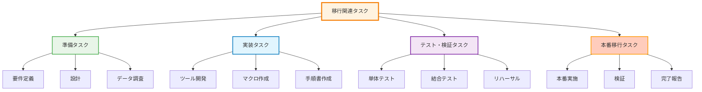
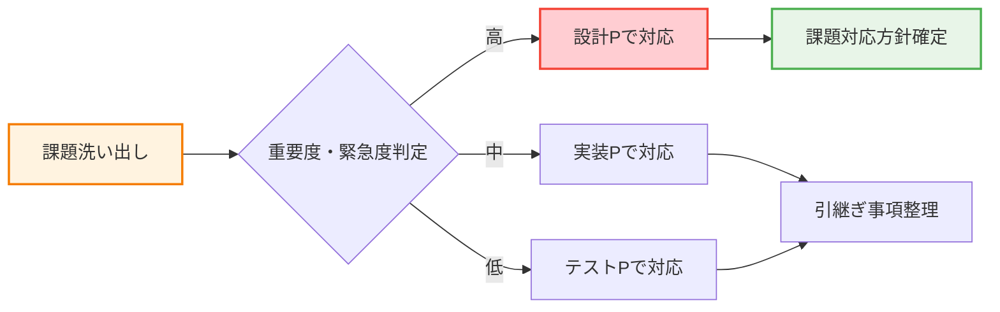

# A05: データ移行計画書-サンプル（PaaS-Elaboration版）

## 1. 概要・位置づけ

### 1.1 目的
本ドキュメントは、要件定義フェーズで策定した「移行方針書」を受けて、Elaborationフェーズで確定すべき以下の事項を整理します：
- **移行関連タスクの網羅的リストアップ**
- **移行実施における課題の洗い出し**
- **次工程（実装フェーズ）への引継ぎ事項の明確化**

### 1.2 前提条件

| 項目 | 内容 |
|------|------|
| **基本方針** | 移行方針書で合意済み |
| **移行方式分類** | システム移行/ユーザー手作業/対象外の3分類 |
| **設計スコープ** | タスク・課題整理まで。具体的マッピングは実装Pで実施 |
| **次フェーズ引継ぎ** | 実装フェーズで詳細な変換ロジック・ツール設計を実施 |

---

## 2. 移行対象データ概要

### 2.1 移行対象データ一覧（サマリー）

**詳細は「移行一覧（別紙）」参照**

| データ分類 | 主要テーブル/機能 | 想定件数 | 移行方式 | 担当 | 実装P詳細化要 |
|-----------|-----------------|---------|----------|------|-------------|
| **マスタ** | 通貨、QUOTATION、リスク区分等 | 300件 | 画面/ツール | TIS | 〇 |
| **トランザクション** | 社内為替予約、銀行為替予約 | 6,000件 | 一括アップロード | 財務部 | 〇 |
| **設定** | 先行予約枠、各種マスタ設定 | 200件 | 画面手動 | 財務部 | △ |

**注1**: 「実装P詳細化要」= 実装フェーズで項目別マッピング・変換ロジック詳細化が必要  
**注2**: 履歴データ・過去データは現行FESTA参照を基本方針とし、移行対象外。業務上必要となった場合は別途検討

---

## 3. 移行関連タスク一覧

### 3.1 タスク分類体系

### 3.2 詳細タスク一覧

#### Phase 1: 準備タスク（要件定義～設計）

| タスクNo | タスク名 | 内容 | 担当 | フェーズ | ステータス |
|---------|---------|------|------|---------|-----------|
| **P1-01** | 移行方針策定 | 基本方針・方式決定 | TIS | 要件定義 | ✅完了 |
| **P1-02** | 移行対象データ特定 | 移行一覧作成 | TIS/財務部 | 要件定義 | ✅完了 |
| **P1-03** | 移行関連タスクリストアップ | 本タスク一覧作成 | TIS | 設計 | 🔄進行中 |
| **P1-04** | 移行課題洗い出し | 課題一覧・対応方針 | TIS/財務部 | 設計 | 🔄進行中 |
| **P1-05** | データ現況調査 | FESTAデータ品質確認 | TIS | 設計 | ⏳未着手 |
| **P1-06** | 移行スケジュール策定（大枠） | 各領域別の大まかなタイムライン作成 | PM/TIS | 設計 | ⏳未着手 |

#### Phase 2: 実装タスク（実装フェーズ）

| タスクNo | タスク名 | 内容 | 担当 | 引継ぎ事項 |
|---------|---------|------|------|-----------|
| **P2-01** | 項目別マッピング定義 | As-Is→To-Be全項目マッピング | TIS | データ調査結果 |
| **P2-02** | 変換ロジック設計 | 変換仕様書作成 | TIS | 課題対応方針 |
| **P2-03** | 移行ツール開発 | PL/SQLプログラム作成 | TIS | 変換ロジック仕様 |
| **P2-04** | Excelマクロ作成 | データ変換マクロ開発 | TIS | CSV形式定義 |
| **P2-05** | 一括アップロード機能開発 | APEX画面機能追加 | TIS | 入力検証仕様 |
| **P2-06** | 移行スケジュール詳細化 | 各領域を統合した詳細タイムライン・依存関係整理 | PM/TIS | Phase1スケジュール、タスク一覧 |
| **P2-07** | 移行手順書作成 | 作業手順詳細化 | TIS | タスク一覧、詳細スケジュール |
| **P2-08** | 検証手順書作成 | 検証項目・基準定義 | TIS | 課題対応状況 |

#### Phase 3: テスト・検証タスク（テストフェーズ）

| タスクNo | タスク名 | 内容 | 担当 | 引継ぎ事項 |
|---------|---------|------|------|-----------|
| **P3-01** | 移行ツール単体テスト | ツール機能確認 | TIS | ツール仕様書 |
| **P3-02** | 移行ツール結合テスト | E2Eテスト | TIS | 手順書 |
| **P3-03** | データ移行リハーサル1回目 | 本番想定実施 | TIS/財務部 | テスト結果 |
| **P3-04** | リハーサル課題対応 | 不具合修正 | TIS | 課題一覧 |
| **P3-05** | データ移行リハーサル2回目 | 最終確認 | TIS/財務部 | 修正内容 |
| **P3-06** | ロールバック訓練 | 緊急時対応訓練 | TIS/財務部 | RB手順書 |

#### Phase 4: 本番移行タスク（本番移行）

| タスクNo | タスク名 | 内容 | 担当 | 引継ぎ事項 |
|---------|---------|------|------|-----------|
| **P4-01** | 本番移行実施 | カットオーバー作業 | TIS/財務部 | リハーサル結果 |
| **P4-02** | データ検証実施 | 自動・手動検証 | TIS/財務部 | 検証手順書 |
| **P4-03** | 移行完了報告 | 結果報告書作成 | PM/TIS | 検証結果 |

---

## 4. 移行課題一覧

### 4.1 課題管理方針

### 4.2 主要課題一覧

| 課題No | 課題内容 | 影響範囲 | 重要度 | 対応方針 | 対応P | 担当 | ステータス |
|-------|---------|---------|--------|---------|-------|------|-----------|
| **C-01** | 外貨使用資金データの取扱い | 廃止機能データ | 高 | To-Be登録方法の検討 | 設計 | 財務部/TIS | 🔄検討中 |
| **C-02** | 親子関係データの変換方式 | 社内為替予約全体 | 高 | 階層構造変換ロジック策定 | 実装P | TIS | 🔄検討中 |
| **C-03** | AYFIX/BKFIX採番ルール | ID採番全般 | 高 | 採番仕様確定 | 実装P | TIS | 🔄検討中 |
| **C-04** | 契約ID移行方針 | 評価替え処理 | 高 | DFF項目として移行 | 実装P | TIS | ✅合意済 |
| **C-05** | データ品質問題対応 | 移行データ全般 | 中 | クレンジング方針策定 | 実装P | TIS | ⏳未着手 |
| **C-06** | 移行時間制約 | カットオーバー | 中 | 性能要件定義 | 実装P | TIS | ⏳未着手 |
| **C-07** | ユーザー作業負荷 | 財務部作業 | 低 | 教育・サポート体制 | テストP | TIS | ⏳未着手 |

### 4.3 課題詳細（重要度：高のみ記載）

#### C-01: 外貨使用資金データの取扱い【最優先検討課題】

**背景**: 
- 現行FESTAの「外貨使用資金」機能はTo-Beで廃止決定
- カットオーバー時点で2030年まで登録されている外貨使用資金データが存在
- カットオーバー前日まで現行FESTAで継続運用？

**課題**:
- 廃止機能のデータをTo-Beシステムにどう登録するか
- カットオーバー時点で「利用ゼロ」は現実的に不可能？
- 既存データの処理方法が未定

**対応方針**:
- 設計フェーズで業務的な取扱い方針を決定（財務部判断）
- システム的フォロー方法の検討：
  - 選択肢1: 簡易ツール作成（移行時の財務部作業支援用）
  - 選択肢2: 社内為替・銀行為替画面への補助機能追加
  - 選択肢3: その他の代替手段
- 業務方針確定後、システム対応方式を具体化

**引継ぎ事項**:
- 外貨使用資金の現状データ件数・金額調査結果
- 財務部での業務的取扱い方針決定内容
- システム対応方式の選定結果

**参考**: 移行一覧・移行定義書に本件を記録し、次工程以降の検討課題として管理

#### C-02: 親子関係データの変換方式

**現状**: As-Isは枝番管理、To-Beは親子関係テーブル

**課題**:
- 枝番から親子関係への変換ロジックが複雑
- 3世代以上の階層をどう扱うか
- 削除済みデータの扱い

**対応方針**:
- 実装フェーズで再帰的変換ロジックを設計
- サンプルデータでの動作確認を先行実施
- 最大階層数の制限を設ける（例: 5階層まで）

**引継ぎ事項**:
- As-Isデータ構造の詳細調査結果
- To-Beテーブル設計（PARENT_ID、ORIGINAL_ID）

#### C-03: AYFIX/BKFIX採番ルール

**現状**: 新番号体系が確定していない

**課題**:
- プリフィクスルール（AYSRP、BKFIX等）の詳細
- 連番の桁数・開始番号
- As-Is番号との対応関係保持方法

**対応方針**:
- 実装フェーズで採番仕様を確定
- 移行時の番号変換マッピングテーブル作成
- 監査証跡用にAs-Is番号も保持

**引継ぎ事項**:
- 番号体系設計案
- As-Isの現在番号範囲調査結果

#### C-04: 契約ID移行方針

**現状**: To-Beで契約IDをDFF（参考情報）として保持することが決定

**課題**:
- CDモジュール発番 vs FE独自発番の識別
- 空値の扱い（先行予約等）
- 評価替え処理での利用方法

**対応方針**: ✅合意済
- 全契約IDをそのまま移行（DFF項目として）
- 空値はNULLとして許容
- 評価替え時は契約ID単位での集計に活用

**引継ぎ事項**:
- 契約ID有無での評価替えロジック差分
- DFF項目定義

---

## 5. 次工程（実装フェーズ）への引継ぎ事項

### 5.1 実装フェーズで確定すべき事項

| 分類 | 確定すべき内容 | 参照情報 |
|------|--------------|---------|
| **データ調査** | FESTAデータ品質・件数・構造の詳細 | P1-05タスク結果 |
| **項目マッピング** | 全項目のAs-Is→To-Be対応表 | A01設計書 |
| **変換ロジック** | 詳細な変換仕様・計算式 | 課題C-01,C-02対応 |
| **性能要件** | 処理時間・リソース要件 | 課題C-07対応 |
| **検証項目** | 自動検証SQL・手動検証手順 | 課題C-06対応 |

### 5.2 引継ぎドキュメント

| ドキュメント | 作成フェーズ | 内容 | 引継ぎ先 |
|-------------|------------|------|---------|
| **移行方針書** | 要件定義（完了） | 基本方針・方式分類 | 実装チーム |
| **移行計画書** | 設計（本書） | タスク・課題一覧 | 実装チーム |
| **移行一覧** | 要件定義（完了） | 移行対象データ詳細 | 実装チーム |
| **データ調査報告書** | 設計 | FESTA現況調査結果 | 実装チーム |
| **課題管理表** | 設計～実装 | 課題・対応状況 | 実装チーム |

### 5.3 実装フェーズ開始条件

| 項目 | 完了基準 | 確認者 |
|------|---------|--------|
| **移行対象確定** | 移行一覧承認 | PM/財務部長 |
| **課題対応方針** | 高重要度課題の方針合意 | PM/財務部長 |
| **スケジュール合意** | 大まかなタイムライン承認 | PM |

---

## 6. リスク管理（サマリー）

### 6.1 主要リスク

| リスク | 発生確率 | 影響度 | 対応方針 | 担当 |
|--------|---------|--------|---------|------|
| データ品質問題多発 | 中 | 高 | 早期データ調査・クレンジング | TIS |
| 変換ロジック複雑化 | 中 | 高 | 段階的実装・十分なテスト | TIS |
| 移行時間超過 | 中 | 高 | 性能要件明確化・最適化 | TIS |
| ユーザー作業遅延 | 中 | 中 | 教育・サポート体制強化 | TIS/財務部 |

---

## 7. 付録：参考情報

### 7.1 関連ドキュメント

- 移行方針書（要件定義フェーズ）
- 移行一覧（別紙）
- A01: データベース設計書
- A03: PL/SQLバッチ処理設計書

### 7.2 今後の予定

- **Elaborationフェーズ**: タスク・課題整理完了
- **実装フェーズ**: 項目マッピング・ツール開発
- **テストフェーズ**: リハーサル・検証
- **本番移行**: 時期未定（プロジェクト全体スケジュールに依存）

---

## 改訂履歴

| 版数 | 改訂日 | 改訂内容 | 作成者 |
|------|--------|---------|--------|
| 1.0 | 2025-XX-XX | 初版作成（Elaborationフェーズ版） | TIS |
