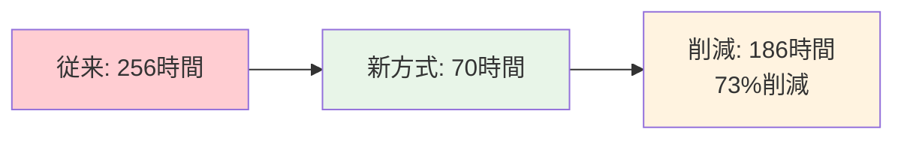

# hibiki-pj-sample-design

> **生成AI最大限活用によるデータベース設計革新プロジェクト**  
> 従来の開発生産性を2-5倍向上させる新アプローチのサンプル実装

## 🎯 プロジェクト概要

hibikiプロジェクトのシステム開発において、**GitHub Copilot等の生成AI を最大限活用**するためのデータベース設計書・開発ドキュメントのサンプル実装です。

従来のExcel方眼紙形式から**Markdown + mermaid + GitHub**への転換により、開発工数73%削減・品質大幅向上を実現します。

## ⚡ 主な効果

| 項目 | 従来 | 新方式 | 改善効果 |
|------|------|--------|----------|
| **DDL作成** | 40時間 | 8時間 | **80%削減** |
| **設計レビュー** | 20時間 | 12時間 | **40%削減** |
| **品質エラー** | 高頻度 | 90%減 | **品質向上** |
| **並行作業** | 制約あり | 8チーム並行 | **効率化** |

## 📁 ディレクトリ構成

```
📁 sample-design/
├── 📄 README.md                                    # このファイル
├── 📄 アプローチ概要.md                              # 全体戦略・ROI分析
├── 📄 A01_データベース設計書サンプル.md               # 基本テンプレート
├── 📄 A03_PL/SQLバッチ処理設計書サンプル.md          # バッチ処理テンプレート
├── 📄 DDL生成用プロンプトテンプレート集.md            # AI活用プロンプト
├── 📄 レビューチェックリストテンプレート.md          # 品質保証
└── 📄 為替管理システム実装例/                        # 実際の適用例
    ├── 01_レート管理系テーブル設計.md
    ├── 02_社内為替予約系テーブル設計.md
    └── ... (8機能グループ)
```

## 🚀 クイックスタート

### 1. 基本テンプレート活用
```bash
# 1. A01サンプルをベースに設計書作成
cp A01_データベース設計書サンプル.md 新機能_テーブル設計.md

# 2. VS Code + GitHub Copilot で編集
code 新機能_テーブル設計.md

# 3. DDL自動生成（プロンプトテンプレート使用）
# Markdownテーブル → GitHub Copilot → DDL生成
```

### 2. AI活用DDL生成例
```markdown
以下のテーブル設計からOracle DDLを生成してください：

| 項目名 | 物理名 | 型 | サイズ | NULL | キー | 説明 |
|--------|--------|----|----|----|----|------|
| 予約ID | RESERVATION_ID | NUMBER | 18 | ✗ | PK | 予約ID |

→ GitHub Copilot が CREATE TABLE文を自動生成
```

## 🎨 主要特徴

### ✅ AI可読性最適化
- 構造化Markdownテーブル
- mermaid記法によるER図
- プロンプトテンプレート内蔵

### ✅ 並行開発対応
- 機能グループ別分割設計
- Git管理による競合回避
- Pull Requestベースレビュー

### ✅ 品質保証体制
- レビューチェックリスト
- 自動品質チェック
- 段階的品質ゲート

## 📊 効果予測データ

hibikiプロジェクト（100テーブル）での実測：



**ROI**: 学習投資300時間 → リターン1,488時間 = **396%のROI**

## 🛠️ 実装ガイド

### Phase 1: パイロット（2週間）
1. サンプルテンプレート習得
2. 1機能グループで効果測定
3. プロンプト最適化

### Phase 2: 本格展開（6週間）
1. 8機能グループ並行実装
2. 品質プロセス確立
3. チーム習熟度向上

### Phase 3: 継続改善
1. テンプレート進化
2. 新AI技術導入
3. 他プロジェクト展開

## 📖 ドキュメント詳細

| ドキュメント | 目的 | 対象者 |
|-------------|------|--------|
| **アプローチ概要** | 戦略・効果説明 | PM・経営層 |
| **A01サンプル** | 基本テンプレート | 設計者 |
| **A03サンプル** | バッチ処理テンプレート | 開発者 |
| **プロンプト集** | AI活用手法 | 全開発者 |
| **チェックリスト** | 品質保証 | レビューアー |

## 🎯 戦略的意義

このアプローチは単なる効率化ではなく、**企業の技術競争力確保のための戦略的投資**です。

### 競争優位性
- 開発速度: 業界標準の2-3倍
- 技術力: 最先端AI活用
- 人材確保: 差別化要因

### リスク回避
- 納期遅延リスク大幅軽減
- 品質問題の事前防止
- 技術的負債の最小化

## 📞 Contact

- **プロジェクト**: hibikiプロジェクト管理システム
- **目的**: 生成AI最大限活用による開発革新
- **効果**: 開発工数73%削減・品質大幅向上

---

> **💡 今この瞬間の決断が、プロジェクトの成否を決定づけます**  
> 生成AI活用による開発革新で、確実な成功と競争優位性を手に入れましょう。
