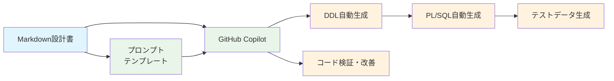
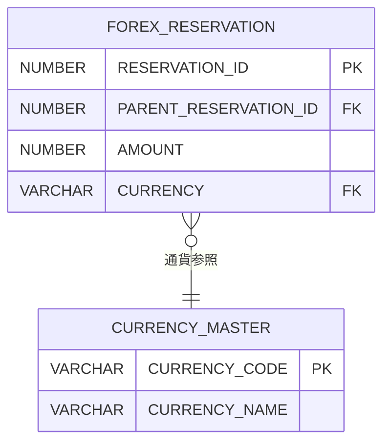
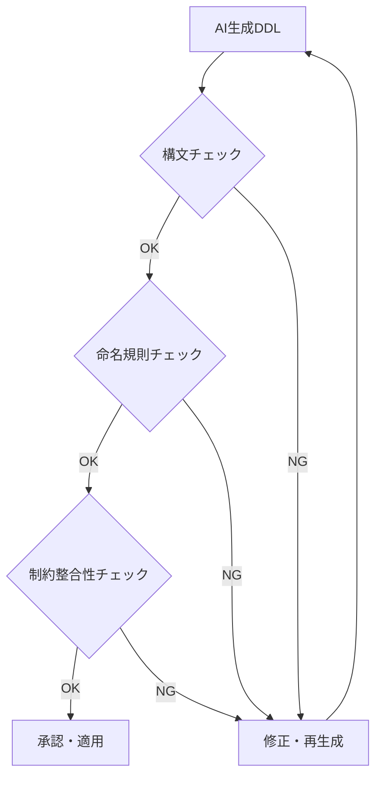
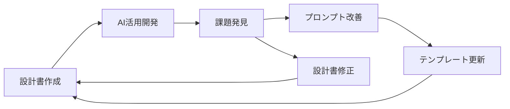

# 生成AI最大限活用を踏まえたデータベース設計書作成アプローチ

## エグゼクティブサマリー

hibikiプロジェクトでは、開発段階での生成AI活用を前提として、従来のExcel方眼紙形式から脱却し、**GitHub + Markdown + mermaid**を活用した新しいデータベース設計書作成アプローチを採用します。これにより、AI活用によるDDL自動生成、コードレビューの効率化、バージョン管理の向上を実現し、開発生産性を大幅に向上させることを目指します。

## 1. 背景と課題

### 1.1 従来アプローチの課題

#### Excel方眼紙形式の限界
- **生成AI非対応**: テキスト抽出が困難で、AIが理解できない形式
- **バージョン管理困難**: 変更履歴の追跡が複雑
- **並行作業制限**: 複数人での同時編集に制約
- **レビュー効率低下**: コメント・修正提案の管理が煩雑

#### 開発段階での問題
```
従来フロー:
Excel設計書 → 手動DDL作成 → 手動コーディング → 手動テスト
           ↑              ↑              ↑
         属人化         ミス発生       非効率
```

### 1.2 生成AI活用の必要性

**hibikiプロジェクトの方針**
- **GitHub Copilot**採用決定済み
- DDL作成、PL/SQLコーディングでの生成AI最大限活用
- 開発生産性向上と品質向上の両立

## 2. 新アプローチの全体像

### 2.1 技術スタック選択

| 要素 | 従来 | 新アプローチ | 選択理由 |
|------|------|-------------|----------|
| **ドキュメント形式** | Excel方眼紙 | **Markdown** | 構造化テキスト、AI可読性◎ |
| **図表作成** | Excel図形 | **mermaid記法** | コードとして管理、自動レンダリング |
| **バージョン管理** | ファイル名管理 | **Git** | 変更履歴追跡、ブランチ管理 |
| **共有・レビュー** | メール添付 | **GitHub** | 行単位コメント、Pull Request |
| **開発ツール** | Excel | **VS Code** | GitHub Copilot統合、拡張性 |

### 2.2 生成AI活用フロー



## 3. データベース設計書の新構成

### 3.1 サンプル構成（A01例）

```
A01: データベース設計書（PaaS各領域毎）
├── 1. 概要・前提条件
├── 2. テーブル一覧
├── 3. 全体ER図（mermaid形式）
├── 4. テーブル設計（Markdownテーブル形式）
│   ├── 4.1 マスタ系テーブル
│   ├── 4.2 トランザクション系テーブル
│   ├── 4.3 履歴系テーブル
│   └── 4.4 集計系テーブル
├── 5. インデックス・制約設計
└── 6. DDL生成用プロンプトテンプレート
```

### 3.2 Markdownテーブル形式の例

```markdown
## 為替予約テーブル（FOREX_RESERVATION）

| 項目名 | 物理名 | 型 | サイズ | NULL | キー | 説明 | 業務ルール |
|--------|--------|----|----|----|----|------|------------|
| 予約ID | RESERVATION_ID | NUMBER | 18 | ✗ | PK | 為替予約ID | システム自動採番 |
| 親予約ID | PARENT_RESERVATION_ID | NUMBER | 18 | ✓ | FK | 分割元の予約ID | 分割時のみ設定 |
| 予約金額 | AMOUNT | NUMBER | 15,2 | ✗ | - | 予約金額 | 正の値のみ |
```

### 3.3 mermaid ER図の例



## 4. 大規模プロジェクト対応：分割戦略

### 4.1 為替管理システムでの実装例

**課題**: 100近いテーブルを1つのドキュメントで管理するのは非現実的

**解決策**: 機能グループ別分割 + 統合管理

```
📁 database-design/
├── 📄 00_全体概要・設計標準.md
├── 📄 01_レート管理系テーブル設計.md           (機能1系: 10-15テーブル)
├── 📄 02_社内為替予約系テーブル設計.md          (機能2系: 15-20テーブル)
├── 📄 03_銀行為替予約系テーブル設計.md          (機能4系: 10-15テーブル)
├── 📄 04_ポジション管理系テーブル設計.md        (機能5-6系: 20-25テーブル)
├── 📄 05_評価替え系テーブル設計.md             (機能7系: 15-20テーブル)
├── 📄 06_マスタ・設定系テーブル設計.md         (機能8系: 8-12テーブル)
├── 📄 07_充当消化系テーブル設計.md             (機能9系: 8-10テーブル)
├── 📄 08_帳票・レポート系テーブル設計.md       (機能10系: 5-8テーブル)
└── 📄 99_統合ER図・全体テーブル一覧.md
```

### 4.2 分割の利点

| 観点 | 1本統合 | 機能別分割 |
|------|---------|------------|
| **並行レビュー** | ❌ 不可 | ✅ 可能（8並列） |
| **責任明確化** | ❌ 曖昧 | ✅ 機能別担当明確 |
| **変更影響** | ❌ 全体影響 | ✅ 限定的影響 |
| **ファイルサイズ** | ❌ 巨大 | ✅ 適切なサイズ |
| **保守性** | ❌ 複雑 | ✅ シンプル |# 生成AI最大限活用を踏まえたデータベース設計書作成アプローチ

## 5. 生成AI活用の具体的手法

### 5.1 DDL生成プロンプトテンプレート

```markdown
## DDL生成プロンプト

以下のテーブル設計からOracle DDLを生成してください：

### テーブル設計:
[Markdownテーブル定義をコピー&ペースト]

### 要件:
- Oracle Database 19c以降
- 命名規則準拠
- システム項目自動設定
- 制約・インデックス自動生成
- 日本語コメント付与

### 出力:
1. CREATE TABLE文
2. CREATE INDEX文
3. CREATE SEQUENCE文
4. CREATE TRIGGER文
5. ALTER TABLE文（制約追加）
```

### 5.2 活用パターン

#### パターン1: 基本DDL生成
```
Markdown設計書 → GitHub Copilot → DDL生成 → 実行・検証
```

#### パターン2: 性能最適化
```
設計書 + 性能要件 → GitHub Copilot → 最適化DDL + 根拠 → レビュー
```

#### パターン3: テストデータ生成
```
テーブル定義 → GitHub Copilot → INSERT文 + 検証SQL → テスト実行
```

### 5.3 品質保証

#### チェックポイント
- **構文チェック**: 生成されたDDLの構文妥当性
- **命名規則**: 組織標準への準拠
- **制約整合性**: ビジネスルールとの一致
- **性能考慮**: インデックス・制約の妥当性

#### 検証プロセス


## 6. 運用・レビュー方式

### 6.1 GitHub活用のワークフロー

#### 作成フェーズ
```bash
# 1. ブランチ作成
git checkout -b feature/database-design-group-02

# 2. VS Codeで編集（GitHub Copilot活用）
code 02_社内為替予約系テーブル設計.md

# 3. コミット・プッシュ
git add .
git commit -m "feat: 社内為替予約系テーブル設計書作成"
git push origin feature/database-design-group-02
```

#### レビューフェーズ
```
1. Pull Request作成
2. 自動レンダリング確認（mermaid図含む）
3. 行単位コメント・議論
4. 修正・更新
5. 承認・マージ
```

#### フィードバックループ


## 7. 期待効果と投資対効果

### 7.1 定量的効果

| 活動 | 従来工数 | 新アプローチ | 削減効果 |
|------|----------|-------------|----------|
| **DDL作成** | 40時間 | 8時間 | **80%削減** |
| **テーブル設計書作成** | 80時間 | 60時間 | **25%削減** |
| **レビュー時間** | 20時間 | 12時間 | **40%削減** |
| **修正反映時間** | 16時間 | 4時間 | **75%削減** |

### 7.2 定性的効果

#### 品質向上
- **一貫性**: テンプレート化による標準化
- **精度**: AI活用による人的ミス削減
- **保守性**: 構造化ドキュメントによる理解性向上

#### 効率向上
- **並行作業**: 機能別分割による並行レビュー
- **自動化**: DDL生成・テストデータ作成の自動化
- **継続改善**: フィードバックループによる継続的な改善

### 7.3 学習投資

#### 初期学習コスト
- **Markdown記法**: 2-4時間
- **mermaid記法**: 4-8時間  
- **GitHub操作**: 8-16時間
- **生成AIプロンプト**: 8-16時間

**合計**: 22-44時間（約1週間）

#### ROI計算
```
削減効果: 156時間（従来） → 84時間（新方式） = 72時間削減
学習投資: 44時間
NET効果: 72 - 44 = 28時間削減（35%改善）

※プロジェクト全体では更に大きな効果が期待
```

## 8. 実装計画

### 8.1 段階的導入

#### Phase 1: パイロット実施（2週間）
- A01データベース設計書サンプル作成
- GitHub環境構築
- チーム内での操作習得

#### Phase 2: 本格展開（4週間）  
- 全機能グループでの並行作成
- レビュープロセス確立
- プロンプトテンプレート精緻化

#### Phase 3: 継続改善（継続）
- 開発段階でのAI活用実践
- フィードバック収集・改善
- 他プロジェクトへの展開

### 8.2 成功要因

#### 必要なサポート
- **経営層の理解**: 新しいアプローチへの投資承認
- **現場の協力**: 学習コストを考慮したスケジューリング
- **技術サポート**: GitHub・AI活用の技術支援

#### リスク軽減
- **並行運用**: 従来方式と並行して段階的移行
- **バックアップ**: 重要局面では従来方式も準備
- **継続学習**: 定期的なスキルアップ機会の提供

## 9. 結論

生成AI最大限活用を前提としたデータベース設計書作成アプローチは、hibikiプロジェクトの開発生産性向上と品質向上の両立を実現する重要な施策です。

**成功のための重要要素**:
- **技術選択**: Markdown + mermaid + GitHubの組み合わせ
- **分割戦略**: 機能グループ別での管理・レビュー
- **AI活用**: DDL生成からテストデータまでの包括的活用
- **継続改善**: フィードバックループによる持続的な改善

初期の学習投資を上回る大きな効果が期待でき、組織全体のDX推進にも貢献する取り組みとして、積極的な推進を提案します。

---

## 参考資料

### 技術ドキュメント
- [Markdown記法ガイド](https://www.markdownguide.org/)
- [Mermaid公式ドキュメント](https://mermaid.js.org/)
- [GitHub Docs](https://docs.github.com/)

### サンプル
- [A01: データベース設計書サンプル](./A01_database_design_sample.md)
- [DDL生成プロンプトテンプレート集](./prompt_templates.md)

### プロジェクト管理
- [分割戦略詳細](./database_design_split_strategy.md)
- [レビュープロセス](./review_process.md)
