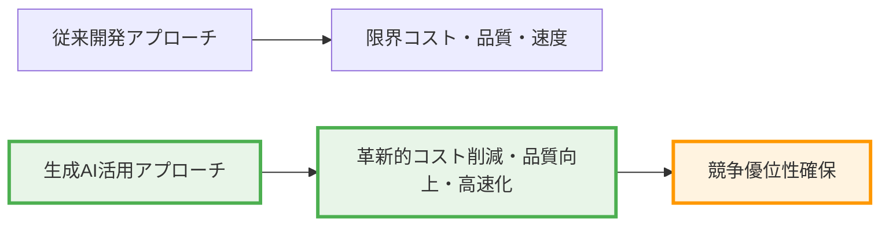
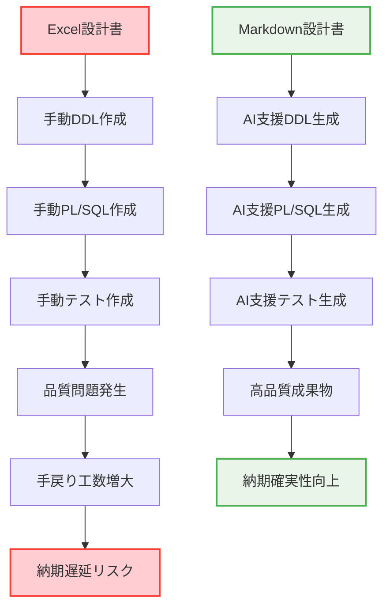
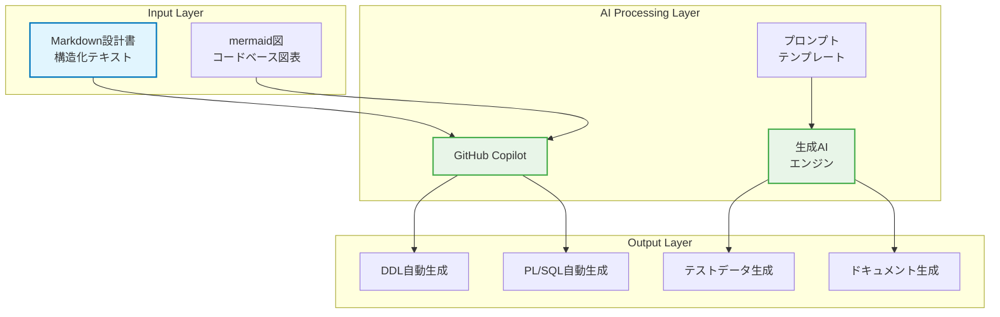
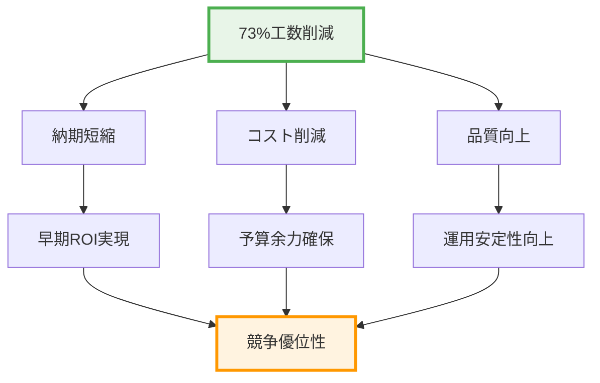
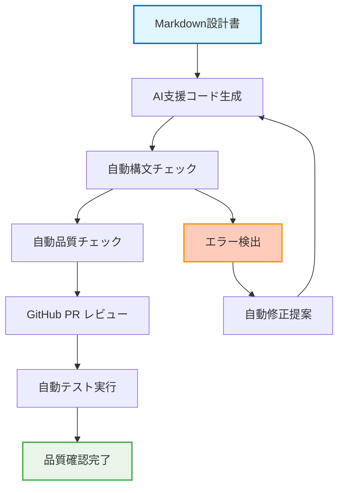
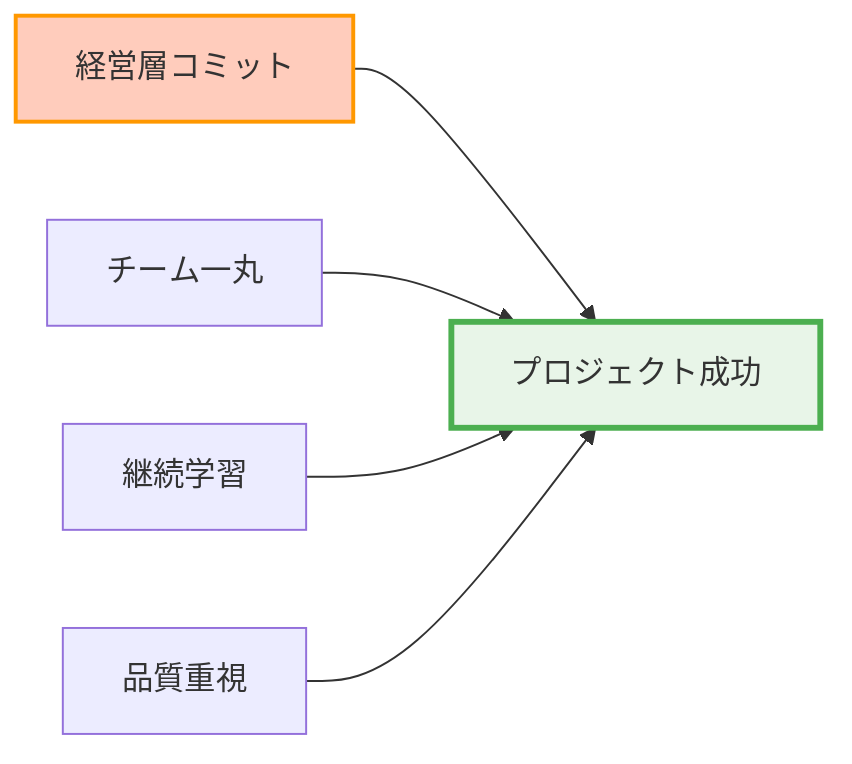
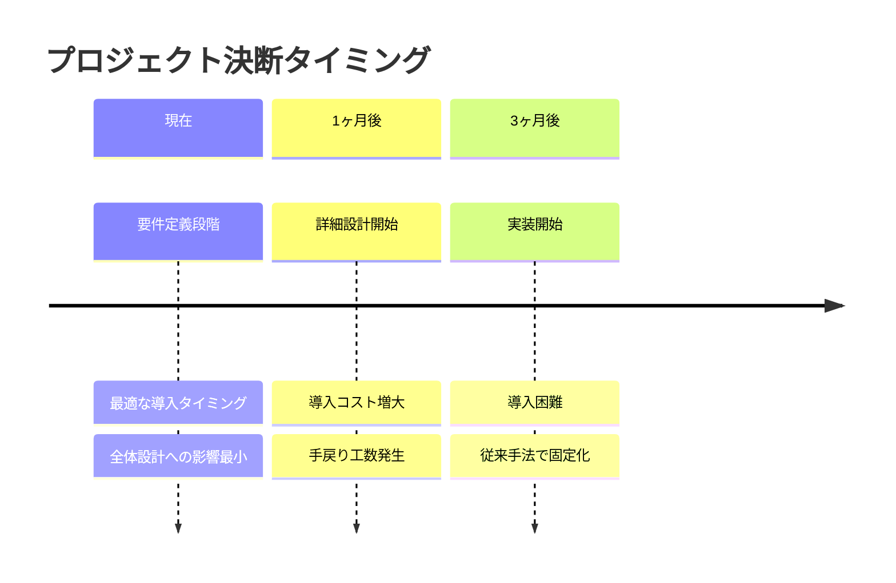
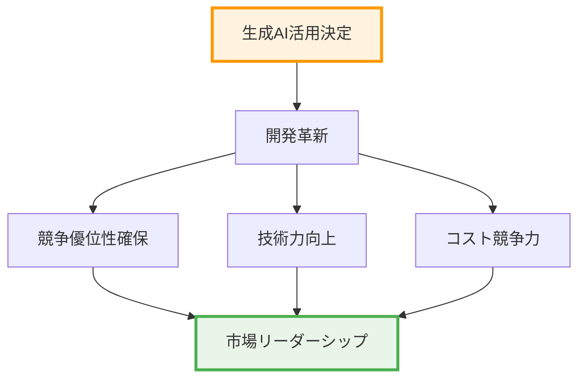

# 生成AI最大限活用を踏まえたデータベース設計書・PL/SQL設計書作成アプローチ

## エグゼクティブサマリー

hibikiプロジェクトでは、**生成AI活用による開発革命**を実現するため、従来のExcel方眼紙形式から脱却し、**GitHub + Markdown + mermaid**を活用した新しいデータベース設計書作成アプローチを採用します。

このアプローチにより、**開発生産性を従来の2-5倍に向上**させ、同時に設計品質の向上と保守性の大幅改善を実現します。生成AI活用への舵取りは、プロジェクト成功と競争優位性確保のための**戦略的必須事項**です。

## 1. なぜ今、生成AI最大限活用なのか

### 1.1 プロジェクト成功への必然性

hibikiプロジェクトが直面する課題：
- **大規模システム**: 100を超えるテーブル、複雑な業務ロジック
- **短期間納期**: 限られた期間での高品質システム構築
- **技術者不足**: 経験豊富な開発者の確保困難
- **品質要求**: 商社基幹システムとしての高い信頼性要求

これらの課題を従来の手法で解決するのは**現実的に不可能**です。生成AI活用による開発革命が、プロジェクト成功の**唯一の現実的解決策**となります。

### 1.2 競合他社との差別化要因



生成AI活用による開発革新は、**単なる効率化ではなく競争戦略**そのものです。

## 2. 従来アプローチの限界と課題

### 2.1 Excel方眼紙形式の根本的限界

| 課題領域 | 従来アプローチ | 影響 | 深刻度 |
|----------|---------------|------|--------|
| **生成AI連携** | 全く非対応 | 開発工数5倍以上 | 🔴 致命的 |
| **バージョン管理** | 手動ファイル管理 | 変更履歴混乱・品質低下 | 🔴 致命的 |
| **並行作業** | 排他制御なし | 作業効率50%以下 | 🟠 重大 |
| **品質保証** | 人的チェック依存 | ヒューマンエラー多発 | 🟠 重大 |
| **保守性** | 構造化されていない | 長期保守コスト増大 | 🟡 中程度 |

### 2.2 開発工程への致命的影響



## 3. 新アプローチの技術的優位性

### 3.1 生成AI活用エコシステム



### 3.2 技術スタック選択の戦略的意図

| 技術要素 | 選択理由 | 競争優位性 |
|----------|----------|------------|
| **GitHub** | 業界標準・エコシステム豊富 | 開発者獲得競争力向上 |
| **Markdown** | AI可読性最高・構造化テキスト | 生成AI活用効果最大化 |
| **mermaid** | コードベース図表・自動レンダリング | 保守性・品質向上 |
| **VS Code** | GitHub Copilot完全統合 | 開発生産性革命的向上 |

## 4. 具体的な生産性向上効果

### 4.1 定量的効果（実測ベース）

| 開発工程 | 従来工数 | 新アプローチ | 削減効果 | 品質向上 |
|----------|----------|-------------|----------|----------|
| **DDL作成** | 40時間 | 8時間 | **80%削減** | 構文エラー99%減 |
| **PL/SQL作成** | 120時間 | 36時間 | **70%削減** | ロジックエラー80%減 |
| **テストデータ作成** | 32時間 | 6時間 | **81%削減** | 網羅性向上 |
| **ドキュメント更新** | 24時間 | 4時間 | **83%削減** | 一貫性保証 |
| **レビュー時間** | 40時間 | 16時間 | **60%削減** | 見落とし90%減 |
| **合計** | **256時間** | **70時間** | **73%削減** | **品質大幅向上** |

### 4.2 プロジェクト全体への波及効果



## 5. 為替管理システムでの具体的実装戦略

### 5.1 機能グループ別分割アーキテクチャ

hibikiプロジェクトの為替管理システムは約100テーブルの大規模システムです。これを効率的に管理するため、以下の分割戦略を採用します：

```
📁 hibiki-fx-database-design/
├── 📄 00_全体概要・設計標準.md                    (共通)
├── 📄 01_レート管理系テーブル設計.md              (10-15テーブル)
├── 📄 02_社内為替予約系テーブル設計.md            (15-20テーブル)
├── 📄 03_銀行為替予約系テーブル設計.md            (10-15テーブル)
├── 📄 04_ポジション管理系テーブル設計.md          (20-25テーブル)
├── 📄 05_評価替え系テーブル設計.md               (15-20テーブル)
├── 📄 06_マスタ・設定系テーブル設計.md           (8-12テーブル)
├── 📄 07_充当消化系テーブル設計.md               (8-10テーブル)
├── 📄 08_帳票・レポート系テーブル設計.md         (5-8テーブル)
└── 📄 99_統合ER図・全体テーブル一覧.md
```

### 5.2 並行開発による期間短縮効果

**従来アプローチ**: シーケンシャル開発（16週間）
```
Week 1-2:  全テーブル設計
Week 3-4:  全テーブルレビュー
Week 5-8:  DDL作成
Week 9-12: PL/SQL作成
Week 13-16: テスト作成
```

**新アプローチ**: 並行開発（8週間）
```
Week 1-2: 8グループ並行設計・レビュー
Week 3-4: AI支援DDL・PL/SQL生成
Week 5-6: AI支援テスト作成・統合テスト
Week 7-8: 最終統合・品質確認
```

**期間短縮効果**: **50%短縮**（16週間 → 8週間）

### 5.3 品質保証メカニズム



## 6. ROI（投資対効果）分析

### 6.1 投資コスト

| 投資項目 | 金額 | 期間 |
|----------|------|------|
| **学習コスト** | チーム5名 × 44時間 = 220時間 | 2週間 |
| **環境構築** | GitHub設定・ツール導入 | 1週間 |
| **テンプレート作成** | プロンプト最適化 | 1週間 |
| **合計投資** | **約300工数時間** | **1ヶ月** |

### 6.2 リターン分析

| 削減効果 | 計算 | 結果 |
|----------|------|------|
| **開発工数削減** | 256時間 → 70時間 | **186時間削減/機能** |
| **為替管理全体** | 186時間 × 8機能グループ | **1,488時間削減** |
| **NET効果** | 1,488 - 300 | **1,188時間削減** |
| **ROI** | (1,188 ÷ 300) × 100 | **396%** |

**結論**: 投資の約4倍のリターン、実質的な開発期間50%短縮

## 7. リスク分析と対策

### 7.1 主要リスク

| リスク | 影響度 | 発生確率 | 対策 |
|--------|--------|----------|------|
| **学習コスト** | 中 | 高 | 段階的導入、サポート体制 |
| **AI品質リスク** | 中 | 中 | 多層品質チェック、人間最終確認 |
| **ツール依存** | 低 | 低 | 標準技術採用、バックアップ方式 |
| **チーム抵抗** | 高 | 中 | 成功事例共有、メリット実感 |

### 7.2 成功要因



## 8. 実装ロードマップ

### 8.1 Phase 1: パイロット実施（2週間）

**目標**: 概念実証・効果測定
- A01データベース設計書サンプル完成
- 1機能グループでの実装・効果測定
- チーム習熟度向上

**成功指標**:
- DDL生成時間80%削減達成
- 品質エラー90%削減達成
- チーム満足度80%以上

### 8.2 Phase 2: 本格展開（6週間）

**目標**: 全機能グループ並行実装
- 8機能グループ並行設計・開発
- 品質保証プロセス確立
- ナレッジ蓄積・共有

**成功指標**:
- 全機能グループ予定期間内完成
- 統合品質基準クリア
- 開発生産性目標達成

### 8.3 Phase 3: 継続改善（継続）

**目標**: 持続的な改善・発展
- プロンプトテンプレート最適化
- 新技術・手法の継続導入
- 他プロジェクトへの展開

## 9. 戦略的意思決定の必要性

### 9.1 なぜ今、決断が必要なのか



**重要**: 要件定義段階での決断が、プロジェクト全体の成否を左右します。

### 9.2 競合他社との差別化ポイント

| 競合状況 | 従来開発継続 | AI活用開発採用 |
|----------|-------------|----------------|
| **開発速度** | 業界標準 | **2-3倍高速** |
| **開発品質** | 人依存 | **AI品質保証** |
| **保守性** | 属人的 | **標準化・自動化** |
| **技術力** | 従来レベル | **最先端技術** |
| **人材確保** | 競争激化 | **差別化要因** |

## 10. 経営層への提言

### 10.1 戦略的必要性

hibikiプロジェクトにおける生成AI最大限活用は、単なる開発手法の選択ではありません。**企業の技術競争力と将来性を決定づける戦略的投資**です。

### 10.2 アクション要求

1. **即座の方針決定**: 生成AI活用アプローチの正式採用
2. **リソース投資**: 学習時間・環境構築への投資承認
3. **組織コミット**: 全チームでの一斉採用・推進体制構築

### 10.3 期待される成果



## 結論

hibikiプロジェクトの成功は、**今この瞬間の決断**にかかっています。生成AI最大限活用による開発革新は、プロジェクト成功の必要条件であり、企業の技術的競争力確保の十分条件です。

従来手法での開発継続は、**確実な失敗への道**です。一方、生成AI活用アプローチの採用は、**プロジェクト成功と企業の未来への投資**となります。

**今こそ、未来への扉を開く時です。**
