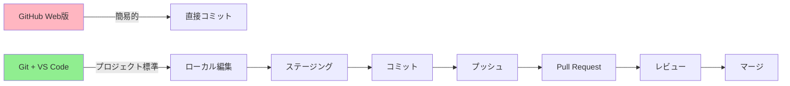
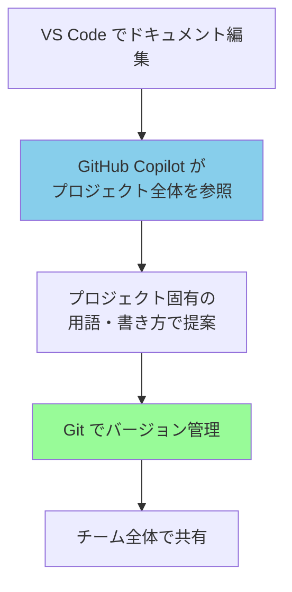
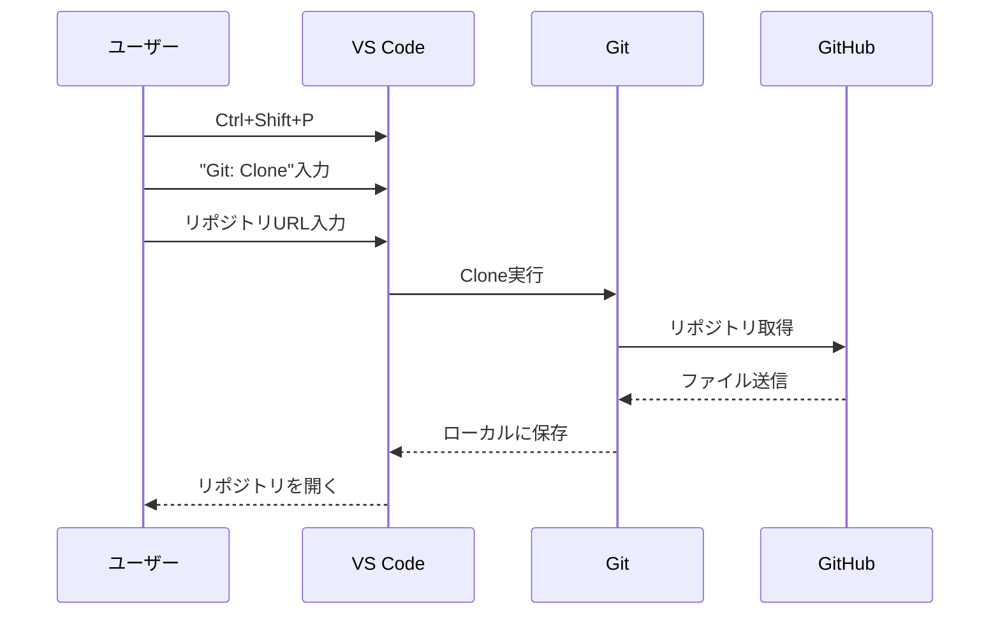
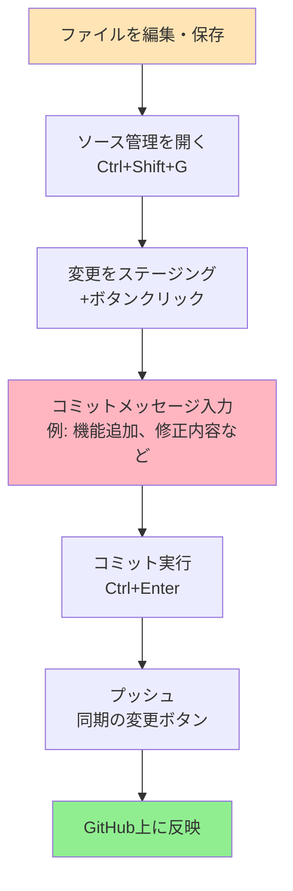

# プロジェクトにおけるGit + VS Code + GitHub Copilot活用ガイド

## 1. なぜGit + VS Code構成が適切なのか

プロジェクトとしてGitHubを活用するなら、**Git + VS Codeの構成が標準的かつ最適**です。

### 主な理由

**ブランチ運用による安全な開発**
- 機能ごとにブランチを切って並行開発が可能
- Pull Requestによるコードレビューフローを確立
- mainブランチへの直接コミットを防ぎ、品質を担保

**複数人での作業に対応**
- コンフリクト（衝突）をローカルで解決してからプッシュ
- 複数の変更を論理的なまとまりでコミット
- 作業履歴が整理され、追跡しやすい

**開発ツールとの統合**
- VS Code一つでコーディング・Git操作・ターミナルが完結
- GitHub Copilotなど、AI支援ツールとシームレスに連携
- CI/CDなど自動化ツールとの親和性が高い



## 2. GitHub Copilotとドキュメント管理

**GitHub CopilotはGit管理されたドキュメントと相性が抜群**です。

### Git管理が適している理由

**コンテキストの最大化**
- Copilotは開いているファイルやタブのファイルを参照してコード・文章を提案
- リポジトリ全体がローカルにあることで、プロジェクト固有の用語や書き方を学習
- `#codebase`や`#file`コマンドで、特定ファイルやプロジェクト全体を明示的に参照可能

**バージョン管理による安全性**
- AIが生成したコンテンツも履歴として記録
- 問題があればいつでも過去バージョンに戻せる
- 変更の理由をコミットメッセージで明確化

**チーム全体での知識共有**
- ドキュメントの変更履歴が可視化
- Pull Requestでドキュメントレビューも実施
- メンバー全員が最新のドキュメントにアクセス可能



## 3. 既存メンバーの活用状況と導入ハードル

**GitHub Copilotは既にPJメンバーの多くが活用中**であり、追加の導入コストは最小限です。

### 導入のしやすさ

- VS Codeに既にGitHub Copilot拡張機能をインストール済みのメンバーが多数
- GitHubアカウントとの連携も完了している
- リポジトリをCloneして開くだけで、すぐにCopilotの恩恵を受けられる

**途中参加も容易**
- 新規メンバーも同じ手順でセットアップ可能
- プロジェクト進行中からでも導入できる

## 4. 具体的なセットアップ手順

### 前提条件
- VS Codeインストール済み
- GitHub Copilot拡張機能インストール済み
- GitHubアカウントでログイン済み

### 必要な作業

#### Step 1: Gitのインストール

1. [https://git-scm.com/download/win](https://git-scm.com/download/win) にアクセス
2. インストーラーをダウンロード・実行
3. 基本的に**全てデフォルト設定でOK**
4. VS Codeを再起動

#### Step 2: 初回設定（一度だけ）

VS Codeのターミナル（`Ctrl + Shift + @`）で以下を実行：

```bash
git config --global user.name "あなたの名前"
git config --global user.email "あなたのメールアドレス"
```

#### Step 3: リポジトリのClone

1. VS Codeで `Ctrl + Shift + P` を押す
2. 「Git: Clone」と入力して選択
3. GitHubのリポジトリURL（`https://github.com/ユーザー名/リポジトリ名.git`）を入力
4. 保存先フォルダを選択
5. 「開く」をクリック



これで完了です！

## 5. 基本的な運用フロー

### 日常的な作業の流れ



### プロジェクトでの推奨運用ルール

**基本フロー**
1. 作業開始前に最新を取得（Pull）
2. ブランチを切って作業（feature/機能名）
3. こまめにコミット（意味のある単位で）
4. プッシュしてPull Request作成
5. レビュー後にマージ

**コミットメッセージの書き方**
- 何をしたか明確に記載（例：「ユーザー認証機能を追加」「READMEのタイポ修正」）
- 日本語でOK（チーム内で統一）

## 6. 学習コストと合理性

### 初期学習コスト

**必要な学習項目**
- Git の基本概念（コミット、プッシュ、プル、ブランチ）
- VS Code のソース管理UI操作
- Pull Request の作成とレビュー

**学習時間の目安**
- 基本操作：1-2時間
- 実践で慣れる：1週間程度

### なぜこの方法が最も合理的か

**生成AI活用との相性**
- GitHub CopilotはGit管理されたプロジェクトで真価を発揮
- プロジェクト全体のコンテキストを理解した提案が可能
- ドキュメントもコードも同じフローで管理でき、学習コストが分散しない

**長期的な効率化**
- 初期学習コストは数日だが、その後の生産性向上は継続的
- 自動化・AI支援ツールとの連携で、さらに効率アップ
- 業界標準の手法を学ぶことで、他プロジェクトでも応用可能

**リスク管理**
- 変更履歴が全て記録され、問題発生時に即座に対応
- AIが生成したコードも安心して活用できる


## まとめ

Git + VS Code + GitHub Copilotの構成は、**プロジェクトとして持続可能で拡張性の高い開発環境**を提供します。

- 複数人での安全な並行開発が可能
- GitHub Copilotの能力を最大限に引き出せる
- 既存メンバーの活用状況を考えると導入ハードルは低い
- 初期学習コストはあるが、長期的には最も合理的
- 業界標準の手法を習得できる

**今すぐ始められます：** Gitをインストール → リポジトリをClone → 開発開始！
